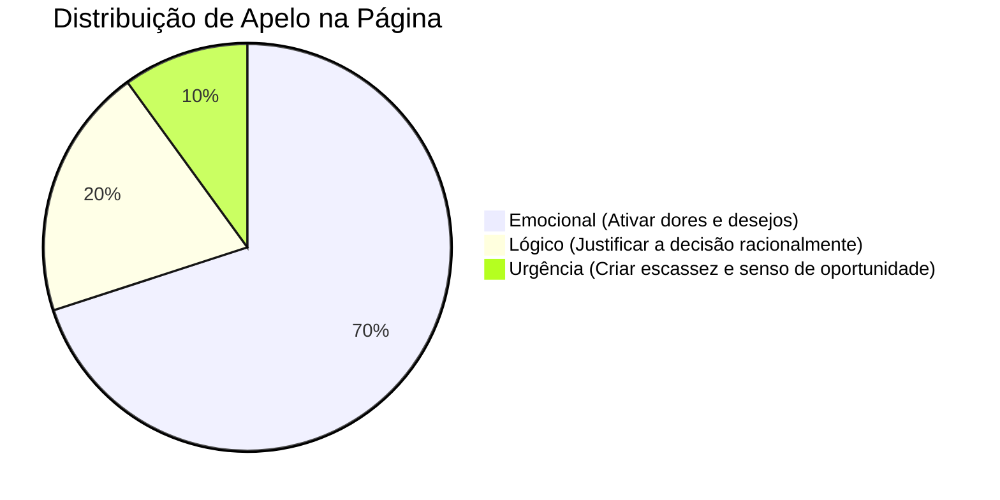

# FRAMEWORK COMPLETO PARA CRIAÇÃO DE PÁGINAS DE VENDAS

---

# ÍNDICE

1. [Princípios Fundamentais](#principios-fundamentais)
2. [Processo de Criação (Passo a Passo)](#processo-de-criacao)
3. [Briefing Obrigatório](#briefing-obrigatorio)
4. [Arquitetura de Blocos](#arquitetura-de-blocos)
5. [Técnicas de Copywriting](#tecnicas-de-copywriting)
6. [Checklist de Qualidade](#checklist-de-qualidade)
7. [Gatilhos Mentais](#gatilhos-mentais)
8. [Estrutura de Bônus](#estrutura-de-bonus)
9. [Garantias](#garantias)
10. [FAQ Estratégico](#faq-estrategico)
11. [Elementos Visuais](#elementos-visuais)
12. [Otimização e Conversão](#otimizacao-e-conversao)

---

# PRINCIPIOS FUNDAMENTAIS

## 1. A Regra de Ouro: Uma Única Crença

> [!IMPORTANT]
> **Antes de escrever qualquer coisa, responda com clareza:**
> *"Qual é a ÚNICA coisa que, se o cliente acreditar, ele não terá outra opção a não ser comprar de você?"*

### Defina isso em uma única frase:
* ❌ **Não** tente convencer a pessoa de 1.000 coisas diferentes.
* ✅ **Convença** a pessoa de **uma única crença**, de 1.000 formas diferentes ao longo de cada bloco.

> **Exemplo Prático:**
> * **Produto:** Academia Viral
> * **Única Crença:** *"O TikTok Shop está na Fase 1 no Brasil e usar as Lojas Ocultas AGORA é a forma mais rápida e segura de sair da CLT sem correr riscos."*

---

## 2. Hierarquia de Persuasão

A estrutura de convencimento da sua página deve seguir a seguinte proporção de apelo:



1. **EMOCIONAL (70%)** → Conecta com dores reais, frustrações e desejos profundos do público.
2. **LÓGICO (20%)** → Justifica a decisão de compra de forma racional (recursos, entregáveis, bônus).
3. **URGÊNCIA/ESCASSEZ (10%)** → Cria o senso de oportunidade imediata para evitar a procrastinação.

---

## 3. Estrutura em 3 Atos

A jornada de leitura do visitante é dividida em três momentos estratégicos:

```
┌──────────────────────────────────────────────────────────┐
│              ATO 1: CONEXÃO EMOCIONAL                    │
│  - Capturar atenção imediata                             │
│  - Ativar as dores principais                            │
│  - Criar identificação (empatia)                         │
└──────────────────────────┬───────────────────────────────┘
                           ▼
┌──────────────────────────────────────────────────────────┐
│              ATO 2: CONSTRUÇÃO DE VALOR                  │
│  - Apresentar a solução (o produto)                      │
│  - Validar com provas sociais e depoimentos              │
│  - Apresentar o mecanismo único de diferenciação         │
│  - Empilhar valor perceptível                            │
└──────────────────────────┬───────────────────────────────┘
                           ▼
┌──────────────────────────────────────────────────────────┐
│                   ATO 3: CONVERSÃO                       │
│  - Revelar a oferta irrecusável                          │
│  - Remover riscos (Garantias)                            │
│  - Quebrar objeções remanescentes (FAQ)                  │
│  - Conclamar à decisão (CTA Final + Urgência)            │
└──────────────────────────────────────────────────────────┘
```

---

# PROCESSO DE CRIAÇÃO

## Fase 1: Coleta de Informações (Pesquisa)

### 1.1 Analise o VSL (Video Sales Letter) ou Pitch de Vendas
* Extraia os problemas e dores centrais citados.
* Identifique as promessas principais e secundárias.
* Mapeie o mecanismo único de funcionamento da solução.
* Liste bônus, garantias e depoimentos fornecidos.

### 1.2 Entreviste o Produtor/Expert (Se aplicável)
* Qual é a maior frustração que o público-alvo enfrenta no dia a dia?
* Qual é a transformação exata e mensurável que o produto entrega?
* Qual é o diferencial que torna este produto incomparável aos concorrentes?
* Quais são as objeções mais comuns que impedem a compra?
* Quais histórias ou resultados marcantes de alunos existem?

### 1.3 Faça Pesquisa de Mercado
* Analise as páginas de vendas dos 3 principais concorrentes diretos.
* Identifique padrões de comunicação que funcionam no nicho.
* Mapeie o vocabulário, termos e gírias utilizados pelo público-alvo nas redes sociais.
* Identifique tendências de mercado ou novidades regulatórias/tecnológicas que possam ser usadas como alavanca de urgência.

---

## Fase 2: Planejamento Estratégico

### 2.1 Defina a "Única Crença"
Escreva a frase condutora da página e mantenha-a visível durante todo o processo de escrita.

### 2.2 Mapeie a Jornada de Transformação
* **Antes:** Como é a rotina atual do cliente? Quais frustrações ele vive?
* **Durante:** O que ele aprenderá e aplicará no método?
* **Depois:** Como será a nova realidade dele após obter os resultados?

### 2.3 Liste e Agrupe as Objeções
Mapeie os principais bloqueios de compra em cinco categorias principais:
1. **Dinheiro:** *"Não posso pagar"* ou *"Está caro"*.
2. **Tempo:** *"Não tenho tempo para aplicar"*.
3. **Capacidade:** *"Não sei se funciona para mim"* ou *"É muito difícil"*.
4. **Confiança:** *"Será que o mentor é confiável?"* ou *"Será que é golpe?"*.
5. **Timing:** *"Posso comprar depois"*.

### 2.4 Desenvolva o Mecanismo Único
* Crie um nome proprietário e intrigante para o seu método (ex: *Sistema de Lojas Ocultas*, *Protocolo Pixel de Ouro*).
* Explique a lógica por trás do método de forma simples e visual.
* Demonstre por que os caminhos tradicionais falham e por que o seu mecanismo resolve o problema sem as dores comuns do mercado.

---

## Fase 3: Estruturação dos Blocos

Monte o esqueleto da página dividindo-o em 17 blocos sequenciais:

1. **Headline + Badge + CTA** (Captura de atenção)
2. **Identificação com o Problema** (Agitação da dor)
3. **História Pessoal / Jornada do Herói** (Conexão e empatia)
4. **Apresentação da Solução** (O produto como salvador)
5. **Prova Social / Depoimentos** (Validação social)
6. **Diferenciação** (Por que não é igual aos outros)
7. **Razões para Funcionar** (Justificativa lógica)
8. **Resumo do Conteúdo** (A visão geral)
9. **Processo Simplificado** (Passo a passo intuitivo)
10. **Qualificação do Público** (Para quem é / Para quem não é)
11. **Conteúdo Detalhado** (Módulos por dentro)
12. **Empilhamento de Bônus** (Geração de valor extremo)
13. **Oferta com Preço** (Revelação da proposta e âncoras)
14. **Autoridade do Mentor** (Credenciais e história de sucesso)
15. **Garantia** (Remoção total de risco)
16. **FAQ Estratégico** (Quebra de objeções técnicas)
17. **Empilhamento Final + Urgência** (CTA de fechamento)

---

## Fase 4: Escrita da Copy (Redação)

### 4.1 Foco na Mensagem Central
Nunca se desvie da Única Crença definida na Fase 2.

### 4.2 Aplique a Fórmula PAS por Bloco
* **P**roblema: Identifique e descreva a dor.
* **A**gitação: Aprofunde as consequências emocionais e práticas de não resolver esse problema.
* **S**olução: Apresente o método ou recurso que soluciona essa dor específica.

### 4.3 Linguagem Conversacional e Fluida
* Escreva da forma como as pessoas conversam.
* Use perguntas retóricas para manter o leitor engajado.
* Evite parágrafos com mais de 3 linhas para facilitar a leitura rápida (escaneabilidade).
* Substitua termos abstratos por metáforas visuais.

---

## Fase 5: Revisão e Otimização

### 5.1 Checklist Rápido de Revisão
- [ ] A Única Crença está clara e presente em toda a narrativa?
- [ ] Todas as objeções mapeadas foram quebradas ao longo da página?
- [ ] A história do mentor gera conexão emocional genuína?
- [ ] Os bônus têm narrativas de necessidade associadas a eles?
- [ ] O preço tem uma ancoragem de valor forte antes de ser revelado?
- [ ] A garantia remove qualquer percepção de risco financeiro?
- [ ] O FAQ responde às dúvidas que realmente impedem a compra?
- [ ] Existem elementos claros de escassez e urgência no final?

### 5.2 Teste de Leitura e Fluxo
* Leia a página inteira em voz alta para identificar quebras de ritmo ou frases confusas.
* Peça para uma pessoa do perfil do público-alvo ler e explicar o que entendeu da proposta.

### 5.3 Polimento Final
* Elimine palavras desnecessárias e adjetivos vazios.
* Destaque em **negrito** as frases de maior impacto para guiar a leitura dinâmica.
* Revise minuciosamente a ortografia e a gramática.

---

# BRIEFING OBRIGATÓRIO

> [!IMPORTANT]
> Preencha esta ficha estratégica antes de iniciar a redação da página. Ela servirá como o guia de referência para toda a copy.

```markdown
### 1. NÚCLEO DA MENSAGEM
* **A Única Crença:**
  > ✍️ _[Escreva aqui a única afirmação que o cliente precisa acreditar para comprar o produto]_

---

### 2. PÚBLICO-ALVO (PERSONA)
* **Situação Atual:**
  > _[Ex: Funcionário CLT insatisfeito, trabalha 10h por dia, ganha 2 salários mínimos e não vê perspectiva de crescimento]_
* **Principais Dores:**
  1. _[Ex: Falta de tempo para a família]_
  2. _[Ex: Medo de demissão ou instabilidade]_
  3. _[Ex: Contas acumulando no final do mês]_
* **Principais Desejos:**
  1. _[Ex: Ter liberdade de trabalhar de qualquer lugar]_
  2. _[Ex: Faturar pelo menos R$ 10.000 por mês]_
  3. _[Ex: Dar conforto e segurança para a família]_
* **Principais Objeções a Quebrar:**
  1. _[Ex: "Não tenho dinheiro para investir agora"]_
  2. _[Ex: "Não levo jeito para tecnologia ou internet"]_
  3. _[Ex: "Tenho vergonha de aparecer em vídeos"]_

---

### 3. PRODUTO E OFERTA
* **Nome do Produto:** _[Nome do Produto]_
* **Formato:** _[Ex: Curso online, Mentoria, Assinatura, Comunidade, Software]_
* **Promessa Principal (Headline-focused):**
  > _[Resultado específico e mensurável dentro de um prazo]_
* **Mecanismo Único (Nome do Método):**
  > _[O nome exclusivo do seu método que gera o resultado]_
* **Precificação:**
  * **Preço de Ancoragem (Valor Percebido):** R$ _[Valor]_
  * **Preço de Venda Real (À vista):** R$ _[Valor]_
  * **Opção de Parcelamento:** _[X]_x de R$ _[Valor]_

---

### 4. HISTÓRIA DO MENTOR
* **Nome do Expert:** _[Nome do Expert]_
* **Principais Credenciais de Autoridade:**
  > _[Ex: Faturamento comprovado de R$ X milhões, mais de Y alunos, Z anos de mercado]_
* **Jornada Simplificada:**
  * **Ponto de Partida:** _[Como era a vida antes de descobrir o método]_
  * **O Conflito / Fundo do Poço:** _[O evento crítico que forçou a mudança]_
  * **A Descoberta:** _[Como encontrou o mecanismo único/solução]_
  * **O Sucesso:** _[Os resultados alcançados pelo mentor aplicando o método]_
  * **A Missão:** _[Por que decidiu empacotar e ensinar este método para outras pessoas]_

---

### 5. CONTEÚDO E ENTREGÁVEIS
* **Módulos Principais:**
  1. **Módulo 1:** _[Nome do Módulo] - [O que aprende] -> [Resultado que gera no aluno]_
  2. **Módulo 2:** _[Nome do Módulo] - [O que aprende] -> [Resultado que gera no aluno]_
  3. **Módulo 3:** _[Nome do Módulo] - [O que aprende] -> [Resultado que gera no aluno]_
  4. **Módulo 4:** _[Nome do Módulo] - [O que aprende] -> [Resultado que gera no aluno]_

---

### 6. BÔNUS E STORYTELLING
* **Bônus 1:**
  * **Nome Comercial:** _[Nome atraente]_
  * **Preço Estimado individual:** R$ _[Valor]_
  * **Objetivo prático:** _[O que entrega]_
  * **Objeção que elimina:** _[Qual barreira de compra ele destrava]_
* **Bônus 2:**
  * **Nome Comercial:** _[Nome atraente]_
  * **Preço Estimado individual:** R$ _[Valor]_
  * **Objetivo prático:** _[O que entrega]_
  * **Objeção que elimina:** _[Qual barreira de compra ele destrava]_

---

### 7. GARANTIAS
* **Garantia Principal (Incondicional):** _[Ex: 7 dias de satisfação plena]_
* **Garantia Condicional (De Resultado):** _[Ex: Se aplicar tudo em 90 dias e provar que não teve retorno, devolvemos o dinheiro e pagamos R$ 500 do nosso bolso]_

---

### 8. PROVAS SOCIAIS DISPONÍVEIS
- [ ] Prints de WhatsApp / Redes Sociais
- [ ] Vídeos de depoimento de alunos
- [ ] Estudos de caso detalhados (Antes vs. Depois)
- [ ] Prints de faturamento ou resultados operacionais

---

### 9. FATORES DE URGÊNCIA E ESCASSEZ
* **Gatilho Principal:** _[Ex: Apenas 100 vagas com este valor, bônus exclusivo para os 20 primeiros compradores]_
```

---

# ARQUITETURA DE BLOCOS

## Bloco 1: Headline + Badge + CTA

### Objetivo
Capturar a atenção nos primeiros 3 segundos, comunicar a promessa principal do produto de forma inquestionável e incentivar o clique imediato no CTA acima da dobra.

### Estrutura
1. **Selo de Destaque (Badge):** Pequena tag com urgência ou posicionamento especial.
   > **Exemplo:** `[ SELO: Oportunidade Exclusiva - Fase 1 no Brasil ]`
2. **Headline Principal:**
   > [!TIP]
   > **Fórmula da Headline Perfeita:**
   > `[Resultado Desejado]` + `[Sem a Objeção Principal]` + `[Timeframe real/Mecanismo]`
   >
   > * **Exemplo ruim:** *"Aprenda a vender no TikTok Shop."*
   > * **Exemplo excelente:** *"Fature de R$ 5.000 a R$ 15.000 por mês no TikTok sem precisar aparecer em vídeo e sem estoque, dedicando apenas 20 minutos do seu dia."*
3. **Subheadline:** Texto complementar que reforça o mecanismo único e quebra objeções secundárias de capacidade.
   > **Exemplo:** *"Mesmo que você nunca tenha vendido nada na internet e tenha apenas um celular básico com acesso à internet."*
4. **CTA Primário:** Botão grande, com cor de alto contraste e micro-texto de garantia logo abaixo.
   > **Texto do Botão:** `"QUERO COMEÇAR A FATURAR NO TIKTOK AGORA"`

---

## Bloco 2: Identificação com o Problema

### Objetivo
Fazer com que o leitor se identifique emocionalmente com o problema, sentindo que a página foi escrita especificamente para a realidade dele.

### Estrutura
1. **Título Provocativo:** Pergunta direta focado na dor da persona.
   > **Exemplo:** *"Até quando você vai passar 2 horas no trânsito para ganhar um salário que mal paga suas contas?"*
2. **Lista de Dores Emocionais:** 4 a 6 pontos que expõem as frustrações diárias.
   * Use a palavra *"Você..."* para começar os pontos.
   * Aplique metáforas visuais e sensoriais fortes.
   * **Exemplos:**
     * *"Você se sente como uma peça descartável na empresa, sabendo que se for demitido amanhã, será substituído em menos de uma semana."*
     * *"Você sente um aperto no peito toda vez que abre o aplicativo do banco e vê que o salário do mês já acabou antes mesmo de chegar no dia 15."*

---

## Bloco 3: História Pessoal (Jornada do Herói)

### Objetivo
Gerar empatia e conexão profunda através da vulnerabilidade do expert, mostrando que ele já esteve exatamente onde o leitor está hoje.

```
       JORNADA DO HERÓI NA COPY
 ┌──────────────────────────────────┐
 │          A Vida Comum            │  (O expert tinha as mesmas dores)
 └────────────────┬─────────────────┘
                  ▼
 ┌──────────────────────────────────┐
 │      O Fundo do Poço (Crise)     │  (O momento da decisão difícil)
 └────────────────┬─────────────────┘
                  ▼
 ┌──────────────────────────────────┐
 │          A Descoberta            │  (O encontro com o Mecanismo Único)
 └────────────────┬─────────────────┘
                  ▼
 ┌──────────────────────────────────┐
 │         A Transformação          │  (O resultado validado e escalado)
 └──────────────────────────────────┘
```

### Estrutura
1. **Apresentação & Autoridade Atual:** Quem é o mentor hoje e quais são seus marcos de resultado.
2. **A Vida Comum (Identificação):** Como era a vida dele antes do sucesso (ex: CLT frustrado, dívidas).
3. **O Fundo do Poço:** O evento dramático e emocional que o fez dizer "basta" (ex: não ter dinheiro para comprar uma refeição).
4. **As Tentativas Fracassadas:** Mostrar que tentou os métodos tradicionais do mercado e falhou, provando que esses caminhos não funcionam.
5. **A Descoberta do Mecanismo Único:** O momento de clareza onde o novo método foi testado e refinado.
6. **A Transformação de Vida:** O resultado real obtido após a aplicação do novo método.
7. **A Missão:** Por que ele não quer guardar esse segredo apenas para si, justificando a criação do produto.

> [!TIP]
> **Apoio Visual:** Insira fotos reais da época de dificuldade (o "antes") e fotos do estilo de vida atual (o "depois"). A discrepância visual valida a transformação.

---

## Bloco 4: Apresentação da Solução

### Objetivo
Apresentar o produto oficialmente, posicionando-o como a única saída lógica para os problemas apresentados.

### Estrutura
1. **A Revelação:** Introduza o nome do produto de forma marcante.
2. **Definição Clara em Uma Frase:** O que o produto é + o que ele faz.
   > **Exemplo:** *"A Comunidade Academia Viral é o único método passo a passo focado em Lojas Ocultas do TikTok Shop que gera renda passiva sem precisar de estoque ou exposição na internet."*
3. **Qualificações de Barreira Zero:**
   * *"Funciona mesmo que você não saiba nada de tecnologia."*
   * *"Funciona mesmo se você tiver poucas horas livres na semana."*
   * *"Funciona mesmo que você tenha vergonha de aparecer."*

---

## Bloco 5: Prova Social (Depoimentos)

### Objetivo
Validar a eficiência do método usando a voz e os resultados de clientes reais (pessoas comuns), eliminando a desconfiança de que "só funciona para o criador".

### Diretrizes de Prova Social
* Apresente de **3 a 6 depoimentos** bem destacados.
* Dê preferência a depoimentos que relatem **resultados práticos e mensuráveis** obtidos em um curto espaço de tempo.
* Varie os formatos: mescle prints de conversas de WhatsApp, áudios, depoimentos em texto com fotos e vídeos curtos.
* Insira sempre o nome real e a profissão/origem da pessoa para aumentar a autenticidade.

---

## Bloco 6: Diferenciação (Por que somos diferentes)

### Objetivo
Combater o ceticismo do leitor, diferenciando o produto de tudo o que ele já viu ou comprou no mercado de infoprodutos.

### Estrutura
* **O que NÃO é (Quebra de Padrão):** Desvincule seu produto de métodos saturados ou difíceis.
  > * *"Isso não é dropshipping tradicional onde você precisa gastar milhares de reais em anúncios."*
  > * *"Isso não é mercado de afiliados comum onde você precisa ficar implorando para as pessoas comprarem no seu link."*
* **O que É (O Novo Caminho):** Reforce o mecanismo inovador e o momento ideal de mercado.
  > * *"Trata-se de um sistema automatizado de Lojas Ocultas que aproveita o tráfego gratuito que o próprio TikTok entrega todos os dias."*

---

## Bloco 7: Razões para Funcionar

### Objetivo
Dar suporte racional para a decisão do comprador através de dados lógicos, estatísticas de mercado e facilidades técnicas.

### Estrutura
Apresente uma lista com **5 a 7 argumentos lógicos** que comprovem por que o método é infalível:
* **Fácil Execução:** Processo mastigado e ferramentas de automação inclusas.
* **Baixa Barreira de Entrada:** Não exige investimentos iniciais em estoque ou anúncios caros.
* **Momento de Ouro:** Dados estatísticos do crescimento explosivo do TikTok Shop no Brasil.
* **Suporte Próximo:** Acompanhamento diário para tirar dúvidas e evitar travamentos.

---

## Bloco 8: Resumo do Conteúdo

### Objetivo
Criar uma síntese clara do que o comprador vai receber ao finalizar a compra, reforçando a tangibilidade do produto.

### Estrutura
Use uma lista concisa com ícones amigáveis (como `✅`) para listar as entregas principais:
* ✅ **Método Gravado Passo a Passo** (Acesso vitalício)
* ✅ **Modelos de Copys e Roteiros Prontos**
* ✅ **Lista Exclusiva de Fornecedores Nacionais**
* ✅ **Acesso à Comunidade VIP de Alunos**
* ✅ **Suporte Diário com Especialistas**

---

## Bloco 9: Processo Simplificado (Passo a Passo)

### Objetivo
Reduzir a ansiedade e a sensação de sobrecarga do comprador, demonstrando que o caminho até o resultado é simples e estruturado em poucas etapas.

### Estrutura
Desenhe uma linha do tempo clara contendo de **3 a 4 passos simples**:

```
 ┌───────────────┐      ┌───────────────┐      ┌───────────────┐
 │   PASSO 1:    │      │   PASSO 2:    │      │   PASSO 3:    │
 │ Copiar & Colar│ ───> │ Ativar a Loja │ ───> │ Sacar o Pix   │
 │ (Modelos Prontos)  │  (20 min por dia) │  (Direto na conta)│
 └───────────────┘      └───────────────┘      └───────────────┘
```

1. **Passo 1 (Copiar e Colar):** Você acessa a nossa área de membros e escolhe um dos roteiros validados.
2. **Passo 2 (Configurar e Postar):** Siga o passo a passo para configurar a sua Loja Oculta sem precisar gastar um único centavo.
3. **Passo 3 (Colher os Frutos):** Veja as comissões caindo diretamente na sua carteira digital e faça o saque diário.

---

## Bloco 10: Qualificação do Público (Para quem é?)

### Objetivo
Gerar o gatilho de compromisso, fazendo com que o leitor se enxergue na lista de pessoas qualificadas e sinta exclusão ao ler a lista de desqualificados.

### Estrutura
* **Para quem é (Foco no Perfil Ideal):**
  * ✅ Pessoas que possuem apenas de 20 a 30 minutos livres por dia.
  * ✅ Quem deseja ter uma renda extra real sem precisar aparecer nas câmeras.
  * ✅ Mães, pais, estudantes e assalariados que buscam liberdade financeira.
* **Para quem NÃO é (Filtro de Compromisso):**
  * ❌ Pessoas que buscam dinheiro fácil, sem precisar fazer nada.
  * ❌ Quem não está disposto a seguir um método testado passo a passo.
  * ❌ Pessoas acomodadas que preferem continuar reclamando da CLT.

---

## Bloco 11: Conteúdo Detalhado (Módulos)

### Objetivo
Apresentar em detalhes a grade curricular ou os recursos do produto, gerando a sensação de que o conteúdo é extremamente completo e robusto.

### Estrutura
* **Vídeo Tour (Altamente Recomendado):** Um breve vídeo mostrando a área de membros por dentro para tangibilizar o produto.
* **Módulos Estruturados:** Apresente de **6 a 10 módulos** bem organizados, focando sempre na transformação de cada um:
  * **Módulo 1: O Despertar da Mina de Ouro** (Como funciona o ecossistema do TikTok Shop e as configurações iniciais seguras).
  * **Módulo 2: O Garimpo de Produtos** (Como identificar e escolher produtos altamente lucrativos que vendem sozinhos em minutos).
  * **Módulo 3: Criação de Vídeos Magnéticos** (O passo a passo para criar vídeos virais sem precisar gravar nada e sem usar sua voz).

---

## Bloco 12: Empilhamento de Bônus

### Objetivo
Aumentar exponencialmente o valor percebido do produto, resolvendo objeções específicas através de ofertas adicionais gratuitas.

### Anatomia do Bônus Perfeito
Para cada bônus apresentado, siga esta estrutura narrativa:

```markdown
🎁 BÔNUS #1: O Arsenal de Vídeos Virais

[Parágrafo 1 - A Dor da Criação]
Você sente que não tem criatividade ou tempo para criar vídeos do zero? O medo de travar na edição de vídeo te impede de começar?

[Parágrafo 2 - Por que eu criei isso]
Eu sei exatamente como é isso no começo. Por isso, criei um banco de dados privado com mais de 500 criativos validados prontos para uso.

[Parágrafo 3 - O que vem dentro]
Neste bônus você receberá:
✅ Acesso imediato a 500+ vídeos prontos de alta conversão.
✅ Roteiros editáveis para narrativas em áudio de inteligência artificial.
✅ Atualizações semanais com as novas tendências de produtos.

[Parágrafo 4 - Conclusão e Âncora]
Você não precisará gastar horas gravando ou editando. É só baixar, postar e ver as vendas acontecerem.

VALOR SEPARADO: R$ 297,00
HOJE: GRÁTIS!
```

---

## Bloco 13: Oferta com Preço (O Empilhamento de Valor)

### Objetivo
Apresentar o preço da oferta de forma irresistível, demonstrando visualmente que o comprador está fazendo um negócio extremamente vantajoso.

### Estrutura do Empilhamento
Apresente uma lista com os valores individuais somados antes de revelar o preço final de venda:

* Método Principal Academia Viral ➜ `R$ 497,00`
* Bônus 1: O Arsenal de Vídeos Virais ➜ `R$ 297,00`
* Bônus 2: O Script de Vendas Automáticas ➜ `R$ 197,00`
* Bônus 3: Suporte VIP Individualizado ➜ `R$ 197,00`
* **VALOR TOTAL ACUMULADO:** `~~R$ 1.188,00~~`

---

### Revelação da Proposta

> MAS HOJE, VOCÊ NÃO VAI PAGAR NEM PERTO DISSO.
>
> VOCÊ LEVA O MÉTODO COMPLETO + TODOS OS BÔNUS POR APENAS:

# 12x de R$ 29,70
### OU R$ 297,00 À VISTA

* 💳 **Opções de pagamento:** Cartão de Crédito, Pix e Boleto Bancário.
* 🛡️ **Segurança:** Ambiente criptografado e dados 100% protegidos.

---

## Bloco 14: Autoridade do Mentor

### Objetivo
Reforçar a confiança do leitor e mostrar que o mentor é uma autoridade legítima que sabe exatamente o que está ensinando.

### Estrutura
1. **Foto de Destaque:** Imagem de alta qualidade e visual profissional do expert.
2. **Histórico de Resultados:**
   * *"Responsável por mais de R$ 2 milhões em vendas online nos últimos 12 meses."*
   * *"Mais de 5.000 alunos formados e lucrando ativamente."*
3. **Mini-biografia:** 3 parágrafos rápidos que resumem sua trajetória, focando em conquistas palpáveis e na paixão por ensinar o método.

---

## Bloco 15: Garantia Incondicional e Condicional

### Objetivo
Eliminar qualquer sensação de risco financeiro por parte do comprador, transferindo toda a responsabilidade de sucesso para as costas do produtor.

### Estrutura Recomendada: Garantia Dupla
> [!TIP]
> **Camada 1: Garantia Incondicional (7 Dias)**
> Se por qualquer motivo você não gostar do material, da cor da área de membros ou da minha voz, basta nos enviar um único e-mail dentro de 7 dias e devolveremos 100% do seu dinheiro, centavo por centavo. Sem burocracia ou perguntas desconfortáveis.

> [!IMPORTANT]
> **Camada 2: Garantia Condicional de Resultado (90 Dias)**
> Aplique o nosso método por 90 dias completos. Se você me provar que aplicou todas as aulas (mostrando os prints da sua loja configurada e vídeos postados) e não obtiver o retorno do seu investimento inicial, nós devolvemos o valor da sua inscrição e fazemos um Pix adicional de R$ 200,00 do nosso próprio bolso pelo seu tempo perdido. O risco é todo meu.

---

## Bloco 16: FAQ (Perguntas Frequentes)

### Objetivo
Quebrar de forma direta as dúvidas técnicas e desculpas finais de procrastinação que ocorrem no checkout.

### Formato e Perguntas Sugeridas
Mantenha as respostas curtas (1 a 3 frases) e com tom confiante:

* **❓ Preciso aparecer ou gravar vídeos?**
  * *Não! O método foi desenhado justamente para quem deseja criar Lojas Ocultas, usando vídeos prontos ou narrativas de Inteligência Artificial sem expor sua imagem ou voz.*
* **❓ O método funciona para quem está começando do absoluto zero?**
  * *Sim! As aulas são gravadas em formato clique a clique, mostrando desde a criação da sua conta até as primeiras vendas na prática.*
* **❓ Quanto tempo preciso dedicar por dia?**
  * *Com apenas 20 a 30 minutos diários e consistentes você já consegue aplicar o método completo e ver os primeiros resultados.*
* **❓ E se eu não gostar ou não funcionar comigo?**
  * *Você está protegido por nossa Garantia de Satisfação de 7 dias. O reembolso é feito de forma imediata e sem complicações.*

---

## Bloco 17: Empilhamento Final + Urgência

### Objetivo
Realizar a última chamada para ação, colocando o leitor diante de uma escolha óbvia e gerando medo de perder a oportunidade.

### Estrutura das "Duas Opções"
> **Agora você tem apenas dois caminhos para seguir:**
>
> 1. **Opção 1 (Ignorar):** Você fecha esta página, continua vivendo a mesma rotina cansativa de sempre, trabalhando em um emprego estressante e se preocupando se o dinheiro vai dar para pagar as contas no fim do mês.
> 2. **Opção 2 (Agir AGORA):** Você dá esse voto de confiança para si mesmo, garante sua inscrição na Academia Viral com todos os bônus inclusos, e começa a construir sua nova fonte de renda na internet de forma segura.

* ⏳ **Aviso Importante:** Esta oferta promocional e os bônus gratuitos estarão disponíveis apenas durante o período de lançamento. As vagas com suporte VIP são extremamente limitadas.

---

# TÉCNICAS DE COPYWRITING

## 1. Storytelling (Narrativas Envolventes)
* Nunca ensine uma lição ou apresente um recurso de forma abstrata.
* Sempre insira uma narrativa rápida (personagem, conflito, superação) para tornar a informação memorável.
* **Fórmula da história em copy:**
  `Situação Comum` ➜ `O Conflito Inesperado` ➜ `A Jornada de Erros` ➜ `A Descoberta da Chave` ➜ `A Nova Realidade`.

---

## 2. Metáforas Visuais
* Substitua termos difíceis ou tediosos por imagens mentais cotidianas que facilitem a compreensão.
* **Exemplos:**
  * Em vez de *"sistema de distribuição de tráfego orgânico"*, use: *"torneira aberta de clientes gratuitos"*.
  * Em vez de *"modelos pré-configurados de páginas de vendas"*, use: *"o esqueleto pronto que é só preencher os espaços"*.

---

## 3. Especificidade Absoluta (A Força dos Números)
* Evite termos genéricos como *"muitos"*, *"rápido"* ou *"vários"*. Use dados exatos para gerar credibilidade.
* ❌ *"Ganhe muito dinheiro em pouco tempo no TikTok."*
* ✅ *"Fature de R$ 3.542,00 a R$ 8.910,00 nos primeiros 35 dias de operação."*

---

## 4. Estrutura de Contraste (Antes vs. Depois)
* Apresente a dor do modelo antigo versus a facilidade e o alívio do novo modelo.
* **Modelo Antigo:** *Gastar R$ 2.000 em anúncios e ter a conta bloqueada no Facebook.*
* **Nosso Método:** *Vender usando tráfego 100% gratuito e à prova de bloqueios.*

---

## 5. Perguntas Retóricas (Concordância Passiva)
* Faça perguntas ao longo do texto cuja única resposta possível seja *"Sim"*. Isso cria uma inércia mental de aceitação no leitor.
* *“Você concorda que continuar fazendo as mesmas coisas só vai te trazer os mesmos resultados?”*
* *“Se você pudesse escolher entre trabalhar 8 horas para enriquecer seu chefe ou 20 minutos para você mesmo, qual escolheria?”*

---

## 6. Quebra de Padrão e Ritmo
* Alterne o tamanho das frases e crie parágrafos de uma única palavra para manter o leitor atento e quebrar a fadiga da leitura.
* **Exemplo:**
  > A maioria das pessoas acha que precisa de sorte para viralizar na internet.
  >
  > **Mentira.**
  >
  > Viralização não é sorte. É ciência pura.

---

# CHECKLIST DE QUALIDADE (Antes de Publicar)

Antes de aprovar a copy final da sua página de vendas, certifique-se de preencher todos os requisitos abaixo:

- [ ] **A Única Crença está presente de forma implícita ou explícita em todos os blocos estratégicos da página?**
- [ ] **A Headline principal possui a combinação de Promessa + Mecanismo + Remoção de Objeção?**
- [ ] **A história pessoal do mentor demonstra vulnerabilidade real no "fundo do poço"?**
- [ ] **Foram incluídos pelo menos 3 depoimentos focados em resultados numéricos e práticos?**
- [ ] **Todos os bônus listados possuem um motivo de existência justificado por storytelling (quebra de objeções específicas)?**
- [ ] **O preço do produto possui contraste visual com o valor total acumulado da oferta (âncoras de preço)?**
- [ ] **A garantia dupla (incondicional + condicional) está descrita de forma simples e visual?**
- [ ] **O FAQ estratégico responde a todas as objeções listadas no Briefing obrigatório?**
- [ ] **Os botões de CTA possuem textos de ação escritos em primeira pessoa e verbos imperativos claros?**
- [ ] **Toda a redação da página foi revisada para eliminar jargões corporativos e termos técnicos de difícil compreensão?**

---

# GATILHOS MENTAIS APLICADOS

```
┌─────────────────┐ ┌─────────────────┐ ┌─────────────────┐
│    ESCASSEZ     │ │    AUTORIDADE   │ │  PROVA SOCIAL   │
│ "Apenas 100     │ │ "R$ 2 milhões   │ │ Prints e        │
│ vagas com este  │ │ faturados na    │ │ vídeos de       │
│ preço"          │ │ prática"        │ │ alunos reais"   │
└─────────────────┘ └─────────────────┘ └─────────────────┘
┌─────────────────┐ ┌─────────────────┐ ┌─────────────────┐
│  RECIPROCIDADE  │ │  SIMPLICIDADE   │ │AVERSÃO À PERDA  │
│ "Mais de 5      │ │ "Método simples │ │ "O risco é todo │
│ bônus de graça" │ │ em 3 passos"    │ │ meu ou seu      │
│                 │ │                 │ │ dinheiro de volta"
└─────────────────┘ └─────────────────┘ └─────────────────┘
```

1. **Escassez:** Limitação numérica ou de tempo real para forçar a ação imediata.
2. **Autoridade:** Credenciais, conquistas e números do expert que legitimam o ensino.
3. **Prova Social:** Validação externa do produto por meio de depoimentos de terceiros.
4. **Reciprocidade:** Entrega generosa de bônus gratuitos de alto valor agregado.
5. **Simplicidade:** Apresentação do método como uma jornada de poucos passos e fácil aplicação.
6. **Aversão à Perda:** Uso de garantias agressivas que eliminam qualquer possibilidade de prejuízo financeiro.

---

# ELEMENTOS VISUAIS E HIERARQUIA

A estruturação estética da página deve priorizar a escaneabilidade e a clareza visual dos textos:

### Hierarquia de Tipografia Recomendada
* **Headline Principal (Dobra):** `36px a 48px`, peso **Bold/ExtraBold** para destaque imediato.
* **Títulos de Seção (H2):** `28px a 36px`, peso **Bold**, preferencialmente centralizados.
* **Subtítulos e Recursos:** `20px a 24px`, peso **Medium**.
* **Corpo do Texto:** `16px a 18px`, peso **Regular**, com espaçamento de linha confortável (`1.6` a `1.8`).

### Padrão de Cores Estratégicas
* **Fundo da Página (Background):** Branco puro ou cinzas muito claros (`#F8F9FA`) para manter a legibilidade limpa.
* **Texto Principal:** Cinza escuro ou grafite (`#212529`) em vez de preto puro para diminuir o cansaço visual.
* **Cores de Destaque (Brand):** Azul, Roxo ou Verde Escuro para marcar blocos institucionais e títulos.
* **Botões de Ação (CTAs):** Cores de alto impacto cromático (Verde Vibrante ou Laranja) que contrastem fortemente com o fundo e guiem o olhar.

---

# OTIMIZAÇÃO E MÉTRICAS DE CONVERSÃO

Monitore constantemente os seguintes indicadores após a publicação da sua página para realizar ajustes cirúrgicos:

| Métrica | O que mede | Meta Recomendada | Como otimizar caso esteja baixa |
| :--- | :--- | :--- | :--- |
| **Taxa de Conversão** | Percentual de visitantes que compram o produto. | **2% a 5%** (tráfego frio) / **5% a 15%** (tráfego quente) | Ajustar a headline principal ou adicionar mais provas sociais. |
| **Scroll Depth** | Até onde o visitante rola a página de vendas. | **70%+** de usuários alcançam o meio da página | Reduzir blocos de texto muito longos e dinamizar a transição com imagens. |
| **Tempo na Página** | Tempo médio gasto pelo usuário lendo a copy. | **3 a 5 minutos** (mínimo) | Inserir mais storytelling e utilizar vídeos interativos. |
| **CTR nos CTAs** | Taxa de clique nos botões de compra. | **10% a 20%** dos visitantes clicam em algum botão | Tornar os botões mais visuais, contrastantes e ajustar o texto de ação. |
| **Abandono de Checkout** | Usuários que clicam no CTA mas não compram. | **Menos de 30%** de desistência no checkout | Configurar e-mails e mensagens de recuperação automática de carrinho. |

---

> **Este framework é um documento estratégico vivo.**
> Atualize-o regularmente com os aprendizados, testes A/B e resultados obtidos em cada página de vendas criada.
>
> **Última Atualização:** Janeiro 2025  
> **Desenvolvido por:** Antigravity  
> **Metodologia de Referência:** Diretrizes Avançadas de Copywriting e Conversão
