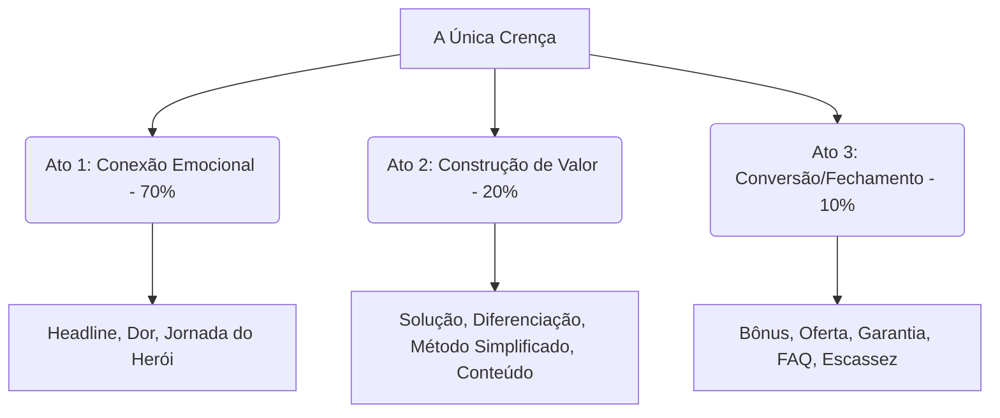
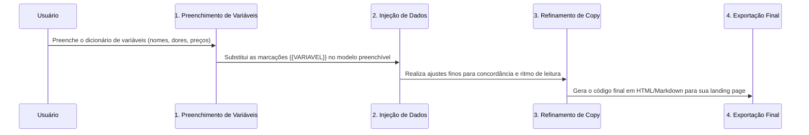

# Sistema Reutilizável de Páginas de Vendas (Framework de Conversão)

Este documento traduz o framework original em um sistema organizacional em dois níveis: um **Template Universal** e um **Modelo Direcionado Preenchível** por variáveis.

---

# 1. Resumo Estratégico da Análise

A eficácia do framework original reside no alinhamento sistemático de três componentes críticos ao longo de toda a página de vendas:

*   **A Única Crença:** A âncora intelectual. Cada bloco da página não tenta provar múltiplos argumentos, mas sim reforçar e provar uma única tese crucial sob diferentes pontos de vista.
*   **Progressão Emocional-Lógica:** A jornada do leitor começa no topo com identificação empática da dor e storytelling (Ato 1), transita para a prova factual e estruturação lógica da solução (Ato 2), e culmina na remoção completa do risco de decisão e senso de urgência imediata (Ato 3).
*   **Mecanismo Único:** A solução é sempre associada a um termo/nome exclusivo, distanciando-a de soluções genéricas ou saturadas no mercado.

---

# 2. Estrutura Base (Template Genérico)

Esta é a fundação conceitual e a ordenação modular que rege a criação de qualquer página de vendas, independente do nicho.

## A Fundação (Briefing Estratégico)
Antes de redigir, defina os seguintes metadados do projeto:
*   **A Única Crença:** A grande afirmação central que valida a compra.
*   **Persona:** Perfil detalhado do cliente ideal.
*   **Dores Principais:** As 3 maiores frustrações cotidianas do cliente.
*   **Desejos Principais:** Os 3 maiores sonhos de transformação do cliente.
*   **Objeções Principais:** Os 3 maiores motivos pelos quais o cliente diria "não".
*   **Mecanismo Único:** O nome próprio dado ao método que gera o resultado.
*   **Nome do Produto:** Nome comercial da oferta.
*   **Âncora de Preço:** Valor fictício/real de mercado vs. Preço da oferta especial.

---

## Estrutura Modular da Página

### Bloco 1: Headline, Selo e CTA de Entrada
*   **Objetivo:** Reter o visitante nos primeiros 3 segundos e apresentar a promessa principal.
*   **Elementos Obrigatórios:** Selo de exclusividade/urgência, Headline orientada a benefícios, subheadline de quebra de objeções iniciais, CTA visível sem scroll.
*   **Estrutura Interna:**
    *   Selo Superior
    *   Título (Promessa principal + Timeframe + Sem barreira tradicional)
    *   Subtítulo (Quebra do maior impedimento secundário)
    *   Botão de Ação Direta (CTA)

### Bloco 2: Conexão e Identificação com a Dor
*   **Objetivo:** Gerar o sentimento de "esta página foi escrita para mim".
*   **Elementos Obrigatórios:** Título reflexivo, lista de cenários comuns de sofrimento da persona, linguagem visual/metafórica.
*   **Estrutura Interna:**
    *   Pergunta Provocativa
    *   Lista de 3 a 5 dores detalhadas
    *   Parágrafo de empatia / validação do sofrimento

### Bloco 3: História (A Jornada do Herói)
*   **Objetivo:** Humanizar o produto, gerar conexão profunda e provar a autoridade do mentor de forma vulnerável.
*   **Elementos Obrigatórios:** Nome do mentor, situação inicial, conflito/fundo do poço, ponto de virada (descoberta do método), validação da solução, missão de ajudar.
*   **Estrutura Interna:**
    *   Introdução pessoal
    *   O relato do fracasso / "fundo do poço"
    *   O dia da descoberta (estalo lógico)
    *   Resultados práticos pós-descoberta
    *   Por que estou compartilhando isso hoje

### Bloco 4: Solução e Mecanismo Único
*   **Objetivo:** Apresentar formalmente o produto e seu funcionamento diferenciado.
*   **Elementos Obrigatórios:** Nome do produto, descrição em uma linha, o nome próprio do Mecanismo Único.
*   **Estrutura Interna:**
    *   Apresentação do Produto
    *   Explicação do Mecanismo Único (Por que é diferente de tudo o que existe)
    *   Qualificações de superação ("Mesmo que...")

### Bloco 5: Prova Social
*   **Objetivo:** Validar a solução através do resultado de terceiros (prova social).
*   **Elementos Obrigatórios:** Depoimentos reais de pessoas comuns com números e dados específicos.
*   **Estrutura Interna:**
    *   Título de validação de mercado
    *   Carrossel ou Grid de 3 a 6 depoimentos (Prints, textos ou vídeos)

### Bloco 6: Processo Simplificado
*   **Objetivo:** Reduzir a ansiedade e a sensação de que o produto é "difícil de aplicar".
*   **Elementos Obrigatórios:** Fluxograma ou lista de 3 a 4 passos simples de ação.
*   **Estrutura Interna:**
    *   Título de simplificação
    *   Passo 1: Ação Básica Inicial
    *   Passo 2: Aplicação do Método
    *   Passo 3: Colheita do Resultado

### Bloco 7: O Conteúdo (Módulos)
*   **Objetivo:** Apresentar a entrega lógica e física do produto, elevando o valor percebido.
*   **Elementos Obrigatórios:** Lista de módulos ou etapas do produto com foco nos benefícios de cada um, não apenas na teoria.
*   **Estrutura Interna:**
    *   Título descritivo do conteúdo
    *   Lista de Módulos (Nome + O que resolve + Transformação gerada)

### Bloco 8: Empilhamento de Bônus (Storytelling de Bônus)
*   **Objetivo:** Neutralizar objeções logísticas remanescentes através de presentes agregados.
*   **Elementos Obrigatórios:** Nome atrativo do bônus, história da dor que gerou o bônus, o que tem dentro, valor individual, preço gratuito se agir hoje.
*   **Estrutura Interna:**
    *   Título do Bloco de Bônus
    *   Card do Bônus #X (Nome, Dor que resolve, Lista de entrega, Valor âncora, Gratuidade)

### Bloco 9: Oferta e Ancoragem de Preço
*   **Objetivo:** Apresentar o preço com alto contraste e valor percebido extremo.
*   **Elementos Obrigatórios:** Lista de tudo que está incluído com preços individuais, preço total ancorado riscado, preço promocional final (parcelado e à vista), selos de segurança.
*   **Estrutura Interna:**
    *   Lista de itens inclusos (Produto + Bônus)
    *   Âncora de preço riscada
    *   Preço Promocional em destaque (12x de R$ XX,XX)
    *   Botão de compra destacado (CTA)
    *   Garantias rápidas de pagamento logo abaixo do botão

### Bloco 10: Garantia Dupla (Reversão de Risco)
*   **Objetivo:** Eliminar o medo de perder dinheiro.
*   **Elementos Obrigatórios:** Selo visual de garantia, prazos específicos (Incondicional e de Resultado).
*   **Estrutura Interna:**
    *   Explicação da Garantia Incondicional (Ex: 7 a 30 dias)
    *   Explicação da Garantia de Resultado (Condicional - Ex: 60/90 dias)
    *   Os 2 cenários finais do comprador (Ganhar o resultado ou receber o dinheiro de volta)

### Bloco 11: FAQ Estratégico
*   **Objetivo:** Responder às últimas barreiras intelectuais do comprador.
*   **Elementos Obrigatórios:** Perguntas e respostas objetivas divididas em Dinheiro, Tempo, Capacidade e Confiança.
*   **Estrutura Interna:**
    *   Lista de 6 a 10 perguntas e respostas curtas

### Bloco 12: Fechamento com Aversão à Perda
*   **Objetivo:** Dar o empurrão final forçando a escolha entre mudar de vida ou continuar no cenário de dor atual.
*   **Elementos Obrigatórios:** Apresentação de duas opções extremas (continuar sofrendo vs. agir com risco zero), CTA final.
*   **Estrutura Interna:**
    *   Cenário A (Ficar igual) vs Cenário B (Agir com segurança)
    *   CTA final definitivo

---

# 3. Estrutura Direcionada (Modelo Preenchível)

Esta seção converte o template em um sistema dinâmico. Substitua os termos entre chaves duplas `{{VARIAVEL}}` para gerar a copy final.

## Dicionário de Variáveis
Preencha esta tabela de dados antes de aplicar as fórmulas:
*   `{{NOME_PRODUTO}}` -> Nome do seu produto.
*   `{{MECANISMO_UNICO}}` -> Nome exclusivo do seu método.
*   `{{RESULTADO_PROMETIDO}}` -> O benefício maior desejado pelo cliente.
*   `{{TIMEFRAME}}` -> Tempo médio para alcançar o resultado.
*   `{{OBJECAO_PRINCIPAL}}` -> O maior medo/desculpa do cliente (Ex: sem aparecer, sem dinheiro).
*   `{{OBJECAO_SECUNDARIA}}` -> O segundo maior impeditivo (Ex: mesmo sem saber mexer em computador).
*   `{{PERSONA_DESCRICAO}}` -> Quem é o seu comprador ideal.
*   `{{DOR_1}}`, `{{DOR_2}}`, `{{DOR_3}}` -> Situações de dor vividas pela persona.
*   `{{DESEJO_1}}`, `{{DESEJO_2}}` -> Sonhos específicos que o cliente quer viver.
*   `{{NOME_MENTOR}}` -> Nome de quem ministra ou assina a copy.
*   `{{FUNDO_DO_POCO}}` -> A pior situação financeira ou emocional vivida pelo mentor no passado.
*   `{{DESCOBERTA_MOMENTO}}` -> O momento exato em que a chave virou para o mentor.
*   `{{VALOR_REAL}}` -> A soma total fictícia/real do produto e bônus.
*   `{{PRECO_VISTA}}` -> O preço promocional para pagamento à vista.
*   `{{PRECO_PARCELADO}}` -> O valor da parcela em 12 vezes.
*   `{{DIAS_GARANTIA_INCONDICIONAL}}` -> Dias de garantia básica por lei/escolha (Ex: 7, 15, 30).
*   `{{DIAS_GARANTIA_RESULTADO}}` -> Dias para a garantia baseada em aplicação do método.

---

## Fórmulas de Copy Preenchíveis

### Bloco 1: Headline, Selo e CTA
> **[SELO]** 🚨 ATENÇÃO: ÚLTIMA CHANCE DE ADERIR À OPORTUNIDADE DO/A `{{MECANISMO_UNICO}}`
>
> # Como Conquistar `{{RESULTADO_PROMETIDO}}` Sem `{{OBJECAO_PRINCIPAL}}` em Apenas `{{TIMEFRAME}}`
>
> **Mesmo que você `{{OBJECAO_SECUNDARIA}}` e esteja começando absolutamente do zero.**
>
> `[ BOTÃO DE COMPRA: QUERO ACESSAR O {{NOME_PRODUTO}} AGORA ]`
> *(Compra segura • Acesso imediato no seu e-mail)*

---

### Bloco 2: Identificação com o Problema
> ## Até quando você vai continuar `{{DOR_1}}`?
>
> Se você é um `{{PERSONA_DESCRICAO}}`, você provavelmente sabe o que é passar por isto diariamente:
>
> *   **Você acorda pensando em como vai resolver** o problema de `{{DOR_2}}`.
> *   **Você se esforça ao máximo,** mas sente que está apenas andando em círculos por causa de `{{DOR_3}}`.
> *   **Você vê outras pessoas conquistando** `{{DESEJO_1}}` enquanto você continua travado no mesmo lugar.
>
> A culpa não é sua. O mercado tradicional te ensina a bater a cabeça na parede. A verdade é que falta apenas uma única coisa para você destravar: o acesso ao `{{MECANISMO_UNICO}}`.

---

### Bloco 3: História (A Jornada do Herói)
> ## Do `{{FUNDO_DO_POCO}}` ao `{{DESEJO_2}}`: Como eu descobri o método
>
> Meu nome é `{{NOME_MENTOR}}` e, antes de eu me tornar referência nisso, eu já estive exatamente no seu lugar.
>
> Há alguns anos, minha realidade era `{{FUNDO_DO_POCO}}`. Eu me sentia frustrado e sem perspectivas de mudança. Tentei de tudo: fiz cursos caros, segui conselhos de gurus, mas nada funcionava.
>
> Até que, em um dia comum, após bater mais uma vez a cara na parede, eu decidi mudar a estratégia. Foi quando eu percebi que a chave para alcançar `{{RESULTADO_PROMETIDO}}` não era trabalhar mais horas, mas sim aplicar `{{DESCOBERTA_MOMENTO}}`.
>
> Foi essa descoberta que deu origem ao `{{MECANISMO_UNICO}}`. Depois de testar e validar em mim mesmo, eu consegui `{{DESEJO_2}}`. 
>
> Hoje, minha missão é fazer com que você não precise passar por todas as dores que eu passei para chegar lá.

---

### Bloco 4: Solução e Mecanismo Único
> ## Apresento o `{{NOME_PRODUTO}}`: O Caminho Definitivo Para Sua Transformação
>
> O `{{NOME_PRODUTO}}` é a única solução completa passo a passo que ensina como implementar o `{{MECANISMO_UNICO}}` para gerar `{{RESULTADO_PROMETIDO}}` sem que você precise passar por `{{OBJECAO_PRINCIPAL}}`.
>
> **Por que o `{{MECANISMO_UNICO}}` funciona?**
>
> Ao contrário de tudo que você já viu no mercado, nosso método foca em resolver especificamente a raiz do problema. Isso significa que:
>
> *   **Não é** mais um curso teórico chato.
> *   **Não exige** que você invista fortunas em ferramentas complexas.
> *   **Entrega** resultados práticos a partir dos primeiros dias de aplicação.

---

### Bloco 5: Prova Social
> ## Veja o que pessoas comuns como você estão conquistando todos os dias:
>
> *"Antes de usar o `{{MECANISMO_UNICO}}`, eu tentava de tudo para resolver `{{DOR_2}}` e nada funcionava. Em menos de `{{TIMEFRAME}}` aplicando o método de `{{NOME_MENTOR}}`, eu consegui finalmente `{{DESEJO_1}}`!"*
> **- Depoimento de Aluno Real**
>
> `[ INSERIR IMAGENS DE DEPOIMENTOS DE WHATSAPP / ANTES E DEPOIS / VÍDEOS DE ALUNOS ]`

---

### Bloco 6: Processo Simplificado
> ## O passo a passo simples para você ter resultados práticos:
>
> Não há segredos. Você só precisa seguir 3 etapas sequenciais:
>
> 1.  **PASSO 1: O Diagnóstico Rápido**
>     Você vai identificar exatamente onde está errando e traçar a rota perfeita.
> 2.  **PASSO 2: A Ativação do `{{MECANISMO_UNICO}}`**
>     Hora de colocar a mão na massa com nosso método direto e simples, mesmo que `{{OBJECAO_SECUNDARIA}}`.
> 3.  **PASSO 3: A Colheita de `{{RESULTADO_PROMETIDO}}`**
>     Colher os frutos do método ativo e automatizar o processo para que ele trabalhe por você.

---

### Bloco 7: O Conteúdo (Módulos)
> ## O que você vai encontrar dentro da Área de Membros:
>
> *   **Módulo 1: O Começo Rápido**
>     Como alinhar as expectativas e dar os primeiros passos práticos rumo ao seu objetivo.
> *   **Módulo 2: Dominando o `{{MECANISMO_UNICO}}`**
>     O método detalhado em cliques e ações fáceis para você destravar `{{RESULTADO_PROMETIDO}}`.
> *   **Módulo 3: Quebrando Barreiras**
>     Como superar obstáculos como `{{OBJECAO_PRINCIPAL}}` e escalar seus resultados sem esforço extra.

---

### Bloco 8: Empilhamento de Bônus (Com Storytelling)
> ## E você ainda leva essa lista de presentes exclusivos:
>
> ### 🎁 BÔNUS #1: O Acelerador do Método
>
> Sabe qual é o maior medo de quem está começando? É se perder no meio do caminho ou travar por falta de orientação. Eu ouço isso todos os dias dos meus seguidores.
>
> Foi exatamente por isso que eu criei este bônus. Eu reuni modelos e scripts prontos para você apenas copiar e colar.
>
> **Você vai levar:**
> *   ✅ Script detalhado de implementação rápida
> *   ✅ Checklist de validação diária
>
> **VALOR ORIGINAL INDIVIDUAL:** ~~R$ 197,00~~
> **ENTRANDO HOJE:** **R$ 0,00 (GRÁTIS)**

---

### Bloco 9: Oferta e Preço
> ## Faça sua inscrição agora com desconto especial de lançamento:
>
> Somando tudo que você vai receber hoje:
>
> *   ✅ Acesso Completo ao `{{NOME_PRODUTO}}` (Valor: R$ 497,00)
> *   ✅ Bônus #1: O Acelerador do Método (Valor: R$ 197,00)
> *   ✅ Suporte Especializado Direto da Equipe (Valor: R$ 297,00)
>
> **VALOR TOTAL DISSO TUDO:** ~~R$ `{{VALOR_REAL}}`~~
>
> ### Mas você garante seu acesso hoje por apenas:
>
> # 12x de R$ `{{PRECO_PARCELADO}}`
> ### ou R$ `{{PRECO_VISTA}}` à vista com desconto
>
> `[ BOTÃO DE COMPRA DESTACADO: QUERO GARANTIR MINHA VAGA AGORA ]`
> *(Pagamento 100% seguro • Liberação de acesso imediata)*

---

### Bloco 10: Garantia Dupla (Risco Zero)
> ## Minha Garantia de Risco Zero Para Você
>
> **Garantia #1 (Incondicional):** Você tem `{{DIAS_GARANTIA_INCONDICIONAL}}` dias para testar todo o conteúdo. Se achar que não serve para você, envie um e-mail e nós devolvemos 100% do seu dinheiro. Sem perguntas.
>
> **Garantia #2 (De Resultado):** Se em `{{DIAS_GARANTIA_RESULTADO}}` dias você me provar que aplicou todas as aulas do `{{NOME_PRODUTO}}` e não obteve `{{RESULTADO_PROMETIDO}}`, eu faço questão de devolver todo o seu dinheiro de volta.
>
> O risco de testar é todo meu. Você não tem absolutamente nada a perder.

---

### Bloco 11: FAQ Estratégico
> ## Suas dúvidas respondidas de forma direta:
>
> **1. Funciona mesmo se eu for um iniciante?**
> Sim! O `{{NOME_PRODUTO}}` foi desenhado justamente para quem está começando do zero. Explicamos o passo a passo de forma simples.
>
> **2. Preciso me dedicar por muitas horas no dia?**
> Não. Dedicando apenas alguns minutos diários você consegue progredir e colher os frutos do `{{MECANISMO_UNICO}}`.
>
> **3. Como eu recebo meu acesso?**
> A liberação é imediata logo após a confirmação do pagamento. Você receberá um e-mail com os dados de login à nossa área de membros.

---

### Bloco 12: Fechamento com Aversão à Perda
> ## A decisão está em suas mãos. Qual caminho você vai escolher agora?
>
> Neste exato momento, você se depara com duas opções distintas:
>
> *   **OPÇÃO A (Ficar igual):** Ignorar esta oportunidade, fechar a aba do navegador e continuar enfrentando a frustração de `{{DOR_1}}` sem perspectivas de melhoria.
> *   **OPÇÃO B (Agir sem risco):** Fazer a sua inscrição hoje no `{{NOME_PRODUTO}}` com risco zero devido às nossas garantias, aprender a dominar o `{{MECANISMO_UNICO}}` e começar a viver `{{DESEJO_2}}`.
>
> Qual delas você escolhe para o seu futuro?
>
> `[ BOTÃO DE COMPRA FINAL: DECIDI MUDAR DE VIDA HOJE ]`

---

# 4. Instruções de Uso

Siga esta sequência operacional para criar sua página de vendas em menos de 30 minutos:

1.  **Etapa de Preenchimento:** Copie a tabela do **Dicionário de Variáveis** e responda a cada linha de acordo com o seu projeto atual. Siga as definições do seu briefing estratégico.
2.  **Substituição Automatizada:** Utilize qualquer ferramenta de texto (como editores de código ou processadores de texto convencionais com a função "Localizar e Substituir") para trocar as variáveis no **Modelo Preenchível** pelos dados correspondentes.
3.  **Refinamento Humano:** Ajuste pequenos detalhes de concordância gramatical (gêneros e plurais) decorrentes das substituições e adicione elementos reais como fotos, depoimentos e links reais dos botões de checkout.
4.  **Implementação Técnica:** Suba a copy refinada no seu construtor de páginas preferido seguindo as regras de formatação (Fontes grandes para títulos, botões grandes e contrastantes).
