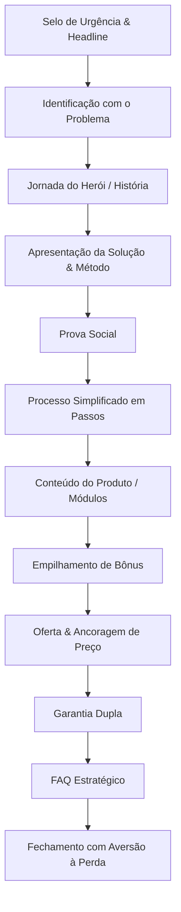

# Template Base: Estrutura de Páginas de Vendas

Este documento contém a fundação estratégica e a estrutura de blocos recomendada para qualquer página de vendas focada em alta conversão.

---

## 1. A Fundação Estratégica (O Briefing)

Antes de escrever qualquer linha de copy, defina e valide as seguintes bases do seu projeto:

*   **A Única Crença:** Qual é a única coisa em que o cliente precisa acreditar para que a compra seja a única opção lógica? Toda a página deve servir para validar esta crença por diferentes ângulos.
*   **A Persona:** Quem é o cliente ideal? (Profissão, desejos, dores, nível de consciência).
*   **As Dores Principais:** Quais são os 3 maiores problemas reais que incomodam a persona no dia a dia?
*   **Os Desejos Principais:** Quais são os 2 ou 3 maiores sonhos de transformação que a persona deseja alcançar?
*   **As Objeções Principais:** Quais são os argumentos lógicos que a persona usará para não comprar? (Tempo, Dinheiro, Capacidade, Confiança).
*   **O Mecanismo Único:** Qual o nome exclusivo/proprietário do método que resolve o problema? (Evite nomes genéricos).

---

## 2. Estrutura Modular da Página de Vendas

A página é dividida em blocos sequenciais estruturados para conduzir o leitor de forma natural pela jornada emocional e lógica.

---

### BLOCO 1: Headline, Selo e CTA de Entrada
*   **Objetivo Estratégico:** Reter a atenção nos primeiros 3 segundos, comunicar a promessa central de forma clara e quebrar a maior barreira de entrada.
*   **Elementos Obrigatórios:**
    *   Selo/Badge com senso de oportunidade (ex.: "Vagas Limitadas", "Nova Turma").
    *   Headline Principal no formato: **[Resultado Desejado] + [Sem a Objeção Principal] + [Timeframe/Tempo]**.
    *   Subheadline que resolve o segundo maior impedimento da persona.
    *   Chamada para Ação (CTA) visível logo no topo da página.

### BLOCO 2: Identificação com o Problema
*   **Objetivo Estratégico:** Gerar empatia imediata (efeito "esta página foi escrita para mim").
*   **Elementos Obrigatórios:**
    *   Pergunta provocativa sobre a situação atual da persona.
    *   Lista de 3 a 5 dores específicas com metáforas visuais.
    *   Validação de que a culpa por falhar no passado não é da persona, mas das abordagens incorretas do mercado.

### BLOCO 3: História (A Jornada do Herói)
*   **Objetivo Estratégico:** Conectar emocionalmente, humanizar a oferta e posicionar o mentor como alguém que já passou pela mesma dor e venceu.
*   **Elementos Obrigatórios:**
    *   Apresentação pessoal curta.
    *   O relato da dor inicial e o "fundo do poço".
    *   O ponto de virada (momento da descoberta do mecanismo).
    *   Validação dos resultados práticos.
    *   A missão: por que resolveu compartilhar isso com o mundo.

### BLOCO 4: Apresentação da Solução e Mecanismo Único
*   **Objetivo Estratégico:** Nomear o produto e diferenciá-lo de tudo o que existe no mercado através do método proprietário.
*   **Elementos Obrigatórios:**
    *   Revelação do nome do produto de forma destacada.
    *   Definição em uma frase clara ("O que ele é" + "O que ele entrega").
    *   Explicação lógica do porquê o **Mecanismo Único** funciona onde as outras soluções falham.
    *   Frases de superação ("Mesmo que você nunca tenha...").

### BLOCO 5: Prova Social
*   **Objetivo Estratégico:** Transferir autoridade e confiança através do resultado de terceiros.
*   **Elementos Obrigatórios:**
    *   Depoimentos focados em resultados palpáveis e mensuráveis.
    *   Uso de formatos variados (prints de conversas, vídeos, fotos).

### BLOCO 6: Processo Simplificado
*   **Objetivo Estratégico:** Mostrar que a implementação é simples e alcançável, aliviando o medo da complexidade.
*   **Elementos Obrigatórios:**
    *   Fluxo dividido em 3 a 4 passos de ação direta.
    *   Uso de verbos imperativos e ícones representativos.

### BLOCO 7: O Conteúdo (Módulos)
*   **Objetivo Estratégico:** Demonstrar organização, clareza e transparência sobre o que é entregue física ou digitalmente.
*   **Elementos Obrigatórios:**
    *   Divisão em módulos claros.
    *   Descrição focada no benefício e transformação prática de cada módulo, não apenas nos tópicos teóricos.

### BLOCO 8: Empilhamento de Bônus (Storytelling de Bônus)
*   **Objetivo Estratégico:** Resolver objeções remanescentes (ex.: falta de tempo, falta de ferramentas) oferecendo soluções rápidas de forma gratuita.
*   **Elementos Obrigatórios:**
    *   Nome atrativo para o bônus.
    *   Mini-história da dor ("Eu percebi que meus alunos travavam na hora de...").
    *   O que está incluso no bônus.
    *   Valor original individual destacado vs. Indicação de Gratuidade.

### BLOCO 9: Oferta e Preço (Ancoragem)
*   **Objetivo Estratégico:** Revelar o preço criando a percepção de que a oferta é extremamente barata em comparação ao valor entregue.
*   **Elementos Obrigatórios:**
    *   Lista visual de todos os componentes inclusos (Produto + Bônus) com seus respectivos valores somados.
    *   Preço total original de mercado riscado.
    *   Preço promocional destacado em parcelas pequenas.
    *   Selo de checkout seguro e opções de pagamento.

### BLOCO 10: Garantia Dupla (Reversão de Risco)
*   **Objetivo Estratégico:** Remover a barreira do medo financeiro assumindo todo o risco da transação.
*   **Elementos Obrigatórios:**
    *   Selo ou imagem de garantia em destaque.
    *   **Camada 1 (Incondicional):** Devolução sem perguntas dentro do prazo de lei/teste (ex.: 7 ou 30 dias).
    *   **Camada 2 (Resultado):** Devolução com base na aplicação prática comprovada do método (ex.: 60 ou 90 dias).

### BLOCO 11: FAQ Estratégico
*   **Objetivo Estratégico:** Eliminar os últimos pontos de fricção mental e responder a dúvidas logísticas/técnicas.
*   **Elementos Obrigatórios:**
    *   Perguntas baseadas em objeções reais de Dinheiro, Tempo, Capacidade e Suporte.
    *   Respostas curtas, objetivas e seguras.

### BLOCO 12: Fechamento com Aversão à Perda
*   **Objetivo Estratégico:** Provocar ação imediata através do medo de continuar na mesma situação de dor.
*   **Elementos Obrigatórios:**
    *   Apresentação de duas alternativas extremas (Ficar no estado atual de dor vs. Agir hoje com risco zero).
    *   CTA final marcante.
