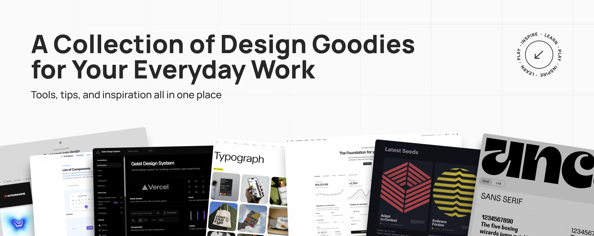

# ❤️ Awesome Design Resources List

Tools, resources, articles, inspiration

Some sections in this list inevitably overlap because design resources often serve multiple purposes. A UI kit might also function as a design system, an icon library can double as an illustration source, and certain tools could be categorized under both generators and accessibility. Instead of treating these as strict boundaries, think of the sections as entry points—groupings that highlight the main use of a resource while acknowledging that many could fit comfortably in more than one place.

Links marked with 🤖 are AI resources.

## 🌐 Inspiration & Community (Showcases, Portfolios, Galleries)

- [Navbar Gallery](https://www.navbar.gallery/) - find the best navigation bar examples for your design
- [SupaHero](https://www.supahero.io/) - a curated collection of beautiful website hero sections
- [Footer Design](https://www.footer.design/) - a curated gallery of the top website footer inspiration on earth. Find the footers you need and sort by type and style
- [CTA.gallery](https://www.cta.gallery/) - curated gallery of Call-to-Actions (CTAs) designed to inspire creativity and maximize conversions
- [Dark Mode Design](https://www.darkmodedesign.com/) - a showcase of beautifully designed and inspiring dark-mode websites
- [Dark Design](https://www.dark.design/) - handpicked dark-mode designs
- [Godly](https://godly.website/) - a curation of the best web design inspiration, everyday
- [Rebrand](https://www.rebrand.gallery/) - explore the best new design systems, visual identity introductions, and rebrand videos
- [Bestfolios](https://www.bestfolios.com/portfolios) - the largest collection of the best portfolio websites from top designers in the industry
- [Dribbble](https://dribbble.com/) - a place to gain inspiration, feedback, community, and jobs
- [Behance](https://www.behance.net/) - the world's largest creative network to showcase work, find inspiration, and get hired
- [A1 Gallery](https://www.a1.gallery) - hand-curated web design inspiration gallery filterable by technology stack, font, style, colour, creator, type, and category — all combinable
- [Awwwards](https://www.awwwards.com/) - the Website Awards that recognize and promote the talent and effort of the best developers, designers, and web agencies in the world
- [Muz.li](https://muz.li/) - a new-tab browser extension that instantly delivers relevant design stories and inspiration to keep you in the loop
- [Savee](https://savee.it/) - a platform where creatives find inspiration
- [Pinterest](https://www.pinterest.com/) - discover recipes, home ideas, style inspiration, design, and other ideas to try
- [BentoGrids](https://bentogrids.com/) - a curated collection of bento designs for your inspiration
- [App Motion](https://appmotion.design/) - explore the best, hand-picked app motion design
- [Mobbin](https://mobbin.com/discover/apps/ios) - the world’s largest mobile and web design library
- [Land-book](https://land-book.com/) - hand-picked website design inspiration
- [BrandGuidelines](https://www.brandguidelines.net/) - handpicked, curated brand guidelines from around the world  
- [Deck.Gallery](https://www.deck.gallery/) - explore curated, beautifully designed presentation decks, slides, keynotes, and guidelines, all chosen for their exceptional design quality  
- [Visuelle](https://visuelle.co.uk/) - an online creative showcase and feed curated by David Bennett, Creative Director at OPX Studio  
- [Logggos](https://www.logggos.club/) - a catalog of well-designed logos
- [Logobook](https://logobook.com/) - a collection of the worlds finest logos, symbols & trademarks
- [Logo System](https://logosystem.co/) - the biggest logo design library for inspiration  
- [abdz](https://abduzeedo.com/) - a collective of individual writers sharing articles about design, photography, and UX, as well as tutorials for Photoshop and other tools  
- [Cosmos](https://www.cosmos.so/) - a discovery engine for creatives  
- [Appshots design](https://appshots.design/) - inspiring real-world UX designs
- [schema.supply](https://www.schema.supply/) - branding, web, and image inspiration, providing a premium digital asset library filled with creative resources
- [Websitevice](https://websitevice.com/) - website examples for inspiration
- [SaaS Landing Page](https://saaslandingpage.com/) - landing page examples created by top-class SaaS companies
- [UI Sources](https://uisources.com/screenshots) - browse recordings of end-to-end user journeys from the top grossing apps
- [Crypto Design Club](https://cryptodesign.club/) - a database of best-in-class handpicked crypto designs
- [Sneak Peek](https://sneakpeek.design/) - see how top design teams design
- [Pushkeen](https://pushkeen.ai/) - the world's largest push notifications library
- [The Component Gallery](https://component.gallery/components/) - an up-to-date repository of interface components based on examples from the world of design systems
- [UI Components Handbook](https://www.uiguideline.com/components) - compiled all the wisdom and best practices from the top 20 Design Systems and UI libraries in one place. We will continue to add more components week after week
- [Design Systems Surf](https://designsystems.surf/) - best-in-class Design Systems with components and foundations references from top-tier tech companies and leading UI teams
- [Landdding](https://landdding.com/) - find daily new web designs submitted to Landdding for showcasing their great design and getting upvotes from the community of web designers
- [Landbook](https://land-book.com/) - website design inspiration gallery
- [Lapa Ninja](https://www.lapa.ninja/) - landing page design inspiration, learn design, and more
- [One Page Love](https://onepagelove.com/) - a website design gallery showcasing the best single-page websites, templates, and resources
- [Minimal Gallery](https://minimal.gallery/) -  a curated source of website design inspiration aiming to support people in their creative process
- [Unsection](https://www.unsection.com/) - browse 3000+ curated website sections from top brands
- [ScreensDesign](https://screensdesign.com/) - discover how successful iOS apps design their screens, onboarding & paywalls. Perfect for designers, developers & product teams
- [Directory of Boring Websites](https://www.boringwebsites.info/) - simple online business ideas that succeed without hype or venture capital
- [Design Spells](https://designspells.com/) - discover micro-interactions, easter eggs, and other seemingly extra design details that infuse life, personality, and fun back into the web
- [Swissted](https://www.swissted.com/) - an ongoing design project and shop by Mike Joyce that reimagines vintage punk and indie rock concert flyers as Swiss Modernist typographic posters
- [Viewport UI](https://viewport-ui.design/) - UI curated experiences for you inspiration

## 💖 Other Collections

- [Fountn](https://fountn.design/) - collection of design resources, curated by designers
- [The Product Design Resources Library](https://www.adhamdannaway.com/design-resources) - a huge collection of design resources for UX and product designers by Adham Dannaway
- [Toolfolio](https://toolfolio.io/) -  helps you find the best tools for productivity, creativity, and design

## 📐 UI Kits & Component Libraries

- [Tailwind components](https://tailwindcss.com/plus/ui-blocks) - in-depth industry-standard compilation of components
- [shadcn/ui](https://ui.shadcn.com/) - beautifully designed components that you can copy and paste into your apps
- [Radix UI](https://www.radix-ui.com/) - an open-source component library optimized for fast development, easy maintenance, and accessibility
- [Elastic UI](https://eui.elastic.co/#/) - design library in use at Elastic to build internal products that need to share our aesthetics
- [Material Design/Components](https://m3.material.io/components) - Google's interactive building blocks for creating a user interface
- [Fluent UI/Components](https://react.fluentui.dev/?path=/docs/concepts-introduction--docs) - Microsoft's component library (react)
- [Nuxt UI](https://ui.nuxt.com) - a UI library for building modern web apps, powered by Vue.js and Tailwind CSS, designed for simplicity and flexibility
- [Untitled UI](https://www.untitledui.com/) - the largest UI kit and design system for Figma
- [Preline UI](https://preline.co/) - an open-source Tailwind CSS components library
- [React Bits](https://reactbits.dev/get-started/index) - React components for creative developers
- [Flowbase](https://www.flowbase.co/) - the world's largest premium library of Webflow, Figma & Framer components and tools. Build better, faster with Flowbase
- [Clonify](https://clonify.io/) - a powerful library of Framer and Figma assets to build stunning websites faster
- [Atomize Design System](https://atomizedesign.com/) - pixel-perfect UI components and multi-brand theme support
- [Nova](https://novaui.design/) - a complete solution for Framer & Figma, offering all the resources needed from concept to launch
- [Shaders](https://shaders.com/) - component library of WebGPU shaders. Includes an editor. Useful for designers to see what's possible and reference

## 🎨 Colors & Palettes

- [Coolors](https://coolors.co/) - generate or browse beautiful color combinations for your designs
- [Randoma11y](https://randoma11y.com/) - an endless collection of accessible color combos
- [MyMind](https://access.mymind.com/colors) - a collection of unique color combinations for your design projects
- [Color Box](https://colorbox.io/) - generate, preview, and organize color palettes  
- [Colorsinspo](https://colorsinspo.com/) - an all-in-one resource to find everything about colors with extreme ease
- [Palette Inspiration](https://paletteinspiration.com/) - color palettes inspired and built from classic master paintings
- [Color Hunt](https://colorhunt.co/) - hand-picked color palettes  
- [Happy Hues](https://www.happyhues.co/) - a color palette inspiration site that acts as a real-world example of how the colors could be used in your design project  
- [Goodpalette](https://goodpalette.io/ed330e-3cc3de-b3adab) - a curated color palette generator that provides aesthetically pleasing color combinations  
- [Tone](https://t-o-n-e.com/) - Color Inspiration - explores natural color schemes of beautiful places on Earth through photography  
- [Adobe Color](https://color.adobe.com/) - gives you the power to extract a beautiful gradient from any image you choose
- [Pigment by ShapeFactory](https://pigment.shapefactory.co/) - a unique way to generate fresh and vibrant colors based on lighting and pigment, instead of math
- 🤖 [AI colors](https://www.bairesdev.com/tools/ai-colors) - create cool and unique color palettes with an AI-powered color palette generator
- 🤖 [Palette Maker](https://palettemaker.com/) - create unique color schemes with AI and see them come to life in real design examples
- [Storied Colors](https://storiedcolors.com/) - named colors with documented histories

## 🔠 Typography (Fonts, Pairing, Generators)

- [Typescale](https://typescale.com/) - a simple tool that allows you to preview and adjust typography scales with different fonts and ratios  
- [Typespiration](https://typespiration.com/) - a complete guide to matching typefaces, styling techniques, improving readability, and more
- [Google Fonts](https://fonts.google.com/) - free to use fonts repository by google
- [Adobe Fonts](https://fonts.adobe.com/) - premium paid fonts repository by Adobe
- [Free Faces Gallery](https://www.freefaces.gallery/) - a curated collection of typefaces that are available under a variety of free licenses somewhere on the interwebs
- [Collletttivo](https://www.collletttivo.it/) - an open-source type foundry and a network of people promoting the practice of type design through mutual exchange and collaboration
- [UNCUT.wtf](https://uncut.wtf/) - a free typeface catalogue, focusing on somewhat contemporary type. There are currently 163 typefaces featured
- [Nerd Fonts](https://www.nerdfonts.com/font-downloads) - advanced fonts for programmers with special glyphs
- [Typefaces.today](https://typefaces.today/) - handpicked typefaces for your creative projects  
- [Fontshare](https://www.fontshare.com/) - a free fonts service from the Indian Type Foundry (ITF), making quality fonts accessible to all  
- [FontsWiki](https://fontswiki.com/) - free typography resource with font downloads, pairing guides, and font-in-use references for logos, films, games, and design projects
- [DaFont](https://www.dafont.com/) - archive of freely downloadable fonts
- [YouWorkForThem](https://www.youworkforthem.com/) - free high-quality fonts and graphics
- [Type Department](https://type-department.com/) - provides designers and brands with high-quality fonts that ignite design solutions and command attention
- 🤖 [Typograph Studio](https://typograph.studio/en) - AI-powered type-design co-pilot
- 🤖 [Mixfont](https://www.mixfont.com/)- identify, generate, and edit fonts, all powered by AI
- 🤖 [Fontjoy](https://fontjoy.com/) - generate font pairings with deep learning
- [Fontpair](https://fontpair.co/) - discover and test fonts, colors, and icons curated by professional designers
- [Fonts by Ani Dimitrova](https://anidimitrova.com/) - custom typeface designes by Ani Dimitrova from Bulgaria
- [About Type](https://abouttype.com/) - an independent type design studio by Krista Radoeva, creating contemporary multilingual typefaces with a focus on Latin and Cyrillic

## 🖌️ Icons & Illustrations (SVGs, Packs, Tools)

- [coolshapes](https://coolshap.es/) - 100+ abstract shapes with cool grainy gradient
- [MapSVG](https://mapsvg.com/maps) - download a free SVG map of any country in the world, free for commercial use
- [Open Doodles](https://www.opendoodles.com/) - a library of sketchy illustrations of people free for personal and commercial use
- [SVG Doodles](https://svgdoodles.com/) - a free collection of different editable SVGs to spice up your online and offline designs
- [unDraw](https://undraw.co/illustrations) - free open-source SVG illustrations
- [DrawKit](https://www.drawkit.com/) - hand-drawn 2D & 3D illustrations, icons and animations
- [ManyPixels](https://www.manypixels.co/gallery) - a royalty-free illustrations gallery
- [Shapes](https://shapes.framer.website/) - SVG shapes that you can easily copy and paste into your designs
- [Absurd Design](https://absurd.design/) - free Surrealist Illustrations
- [Spectrum](https://spectrums.framer.website/) - free vector shapes
- [Illustration.lol](https://www.illustration.lol/) - a curated collection of editorial illustrations and images from illustrators around the world  

### Icon sets

- [Remix Icon](https://remixicon.com/) - open-source neutral-style system symbols elaborately crafted for designers and developers
- [pqoqubbw/icons](https://icons.pqoqubbw.dev/) - beautifully crafted _animated_ icons
- [Font Awesome](https://fontawesome.com/search) - Font Awesome is a font and icon toolkit based on CSS and Less
- [3dicons](https://3dicons.co/) - open-source & free premium 3D icons
- [Streamline](https://www.streamlinehq.com/) - free PNG & SVG icons
- [Game Icons](https://game-icons.net/) - a collection of free game icons
- [Lucide](https://lucide.dev/icons/) - icon toolkit
- [Radix Icons](https://www.radix-ui.com/icons) - a crisp set of 15×15 icons
- [Feather](https://feathericons.com/) - simply beautiful open-source icons
- [Material Symbols](https://fonts.google.com/icons) - Google's Material Design icons pack
- [Weather Icons](https://erikflowers.github.io/weather-icons/) - icon font and CSS with 222 weather-themed icons, ready to be dropped right into Bootstrap, or any project that needs high-quality weather, maritime, and meteorological-based icons
- [Icones](https://icones.js.org) - a powerful icon explorer with over 100,000 icons from various libraries, supporting on-demand import and easy customization  
- [Iconmonstr](https://iconmonstr.com/) - free simple icons collection  
- [Iconoir](https://iconoir.com/) - a high-quality selection of free icons  
- [Iconhub](https://iconhub.io/) - diverse Icon set to complete your awesome design  
- [OpenMoji](https://openmoji.org/) - open-source emojis for designers, developers  
- [Tabler Icons](https://tabler.io/icons) - free and open-source icons designed to make your website or app attractive, visually consistent, and simply beautiful  
- [Phosphor](https://phosphoricons.com/) - a flexible icon family for interfaces, diagrams, presentations
- [Hugeicons](https://hugeicons.com/) - a modern icon library designed for designers and developers who need scalable, customizable, and visually balanced icons
- [Heroicons](https://heroicons.com/) - hand-crafted SVG icons, by the makers of Tailwind CSS
- [Griddy Icons](https://griddyicons.com/) - a free open-source icon family with a unique utilitarian vibe
- 🤖 [Icons8](https://icons8.com/illustration-generator) - AI Generator that makes series of illustrations and icons in the same style
- 🤖 [AI Emojis](https://www.emojis.com/) - turn your ideas into emojis with AI
- 🤖 [The Thiings Collection](https://www.thiings.co/things) - a collection with 2800+ 3D AI generated emojis

## 🖼️ Images & Backgrounds

- [Unsplash](https://unsplash.com/) - a wide variety of high-quality photos contributed by photographers
- [Pexels](https://www.pexels.com/) - free stock photos and videos
- [Pixabay](https://pixabay.com/) - photos, illustrations, vectors, and videos available
- [Burst by Shopify](https://www.shopify.com/stock-photos) - business-oriented images, especially for e-commerce
- [Dupe](https://dupephotos.com/) - relevant royalty-free imagery submitted by a community of creators that can be used commercially under their license
- [Kaboompics](https://kaboompics.com/) - authentic and always consistent free stock photos
- [Picjumbo](https://picjumbo.com/) - free images, backgrounds, and free photos for your projects  
- [Barnimages](https://barnimages.com/) - free stock photos that are high-quality and royalty-free  
- [Openverse](https://openverse.org/) - an extensive library of free stock photos, images, and audio, available for free use  
- [Gratisography](https://gratisography.com/) - royalty-free HD stock photos and images  
- [Shotstash](https://shotstash.com/) - free stock photos for creative professionals  
- [FOCA](https://focastock.com/) - free stock photos for commercial use; design and create for free with FOCA Canvas  
- [Life of Pix](https://www.lifeofpix.com/) - free high resolution photography
- [Shader Gradient](https://www.shadergradient.co/) - create beautiful, moving gradients (available on Figma, Framer, and as React component)
- [RD Tool](https://www.karlsims.com/rdtool.html) - web application to experiment with reaction-diffusion simulations
- 🤖 [Lummi](https://www.lummi.ai/s/photos/guitar) - a collection of unique, royalty-free AI stock photos, illustrations, and 3D
- 🤖 [Midjourney](https://www.midjourney.com/home) - AI image generation
- 🤖 [Dall-E](https://openart.ai/home) - AI image generation
- 🤖 [Stable Diffusion](https://stability.ai/stable-image) - AI image generation
- 🤖 [Adobe Firefly](https://www.adobe.com/products/firefly.html) - AI image generation
- 🤖 [Runway ML](https://runwayml.com/) - a platform to create AI-generated images and videos
- 🤖 [Background Supply](https://www.background.supply/) - AI-generated backgrounds for your next design project
- 🤖 [Grainient](https://grainient.supply/) - offers 1000+ awesome gradients, noisy textured, and AI-generated backgrounds
- 🤖 [Neurascapes](https://www.neurascapes.com/) - AI images made for creators. Curated collections with prompts included
- 🤖 [Hypra](https://hypra.studio/) - next-gen imagery library for creatives and teams

## 📑 Templates (Landing Pages, Presentations, Mockups)

- [Mockuuups Studio](https://mockuuups.studio/) - drag-and-drop tool for creating beautiful app previews or any marketing materials. Easily insert your screenshot into device mockups for free
- [Angle.sh](https://angle.sh) - vector device mockups for Sketch, Figma, and XD
- [Shots.so](https://shots.so) - any mockup that you need. Choose a mockup that suits your needs drag and drop your screenshot, design or any image to get started
- [Mockupworld](https://www.mockupworld.co/) - source of photo-realistic free PSD Mockups online  
- [Pixeden](https://www.pixeden.com/) - exclusive graphic, web, and design assets club (free and paid)  
- [Mockups Design](https://mockups-design.com/) - source of free & high-quality mockups  
- [Mr. Mockup](https://mrmockup.com/free-mockups/) - a huge collection of high-quality free mockups for Photoshop  
- [LS Graphics](https://www.ls.graphics/) - a vast collection of free and premium mockups for Photoshop and Figma  
- [Mockup Hunt](https://mockuphunt.co/) - a huge collection of the best free mockups hand-curated from the most trusted mockup websites  
- [Minimal Mockups](https://www.minimalmockups.com/) - free high-quality mockups  
- [Unblast](https://unblast.com/) - fine and free design resources made by the world's best designers  
- [Flyerwrk](https://www.flyerwrk.com/en-com/collections/freebies) - mockup freebies collection  
- [Mockup Cloud](https://www.mockupcloud.com/) - premium & free mockup templates  
- [Akoya](https://akoyamockups.com/) - photorealistic mockups
- [Maneken](https://maneken.app/) - the browser powered mockup editor

## 🛠️ Production Tools (Gradients, Shadows, Converters, GenAI)

- [TinyPNG](https://tinypng.com/) - the online compressor empowers you to optimize your images easily
- [Tailwind CSS Color Generator | UI Colors](https://uicolors.app/generate) - generate, edit, save, and share Tailwind CSS color shades based on a given hex code or HSL color
- [Boring Avatars](https://boringavatars.com/) - an open-source React library that generates custom, SVG-based user avatars
- [DiceBear Avatars](https://dicebear.com/) - a free avatar library offering customizable, SVG-based avatar styles
- [Pacdora](https://www.pacdora.com/) - an online packaging design tool that integrates editing, 3D preview, rendering
- [Content Core](https://contentcore.xyz/) - render unlimited images and videos in your browser on any compatible device
- 🤖 [Vizcom](https://www.vizcom.com/) - a new way to design for the real world
- 🤖 [Remove.bg](https://www.remove.bg/) - instantly removes image backgrounds with AI, perfect for creating transparent images
- 🤖 [Topaz](https://www.topazlabs.com/topaz-photo) - sharpen, denoise, and upscale your images
- 🤖 [Vectorizer AI](https://vectorizer.ai/) - trace pixels to vectors in full color  
- 🤖 [Suno](https://suno.com/home) - building a future where anyone can make great music
- 🤖 [Captions](https://www.captions.ai/) - creates videos from captions with AI
- 🤖 [Krea](https://www.krea.ai/) - generate, edit, and enhance images and videos using powerful AI for free
- 🤖 [Glorify](https://glorify.com/) - easily create marketing visuals that turn browsers into buyers
- 🤖 [Logome](https://www.logome.ai/) - design your stunning brand logo with AI
- 🤖 [Mokker](https://mokker.ai/) - AI background for product photos
- 🤖 [Relume Ipsum](https://www.relumeipsum.com/) - a fast way to write AI copy for a website
- 🤖 [Gemini 2.5 Flash Image (Nano Banana)](https://aistudio.google.com/models/gemini-2-5-flash-image) - unlock multimodal creativity for the next generation of visual apps
- 🤖 [Logo Diffusion](https://logodiffusion.com/) - create custom logos in seconds with Logo Diffusion's AI Logo Maker
- 🤖 [Flair.ai](https://flair.ai/) - AI tool for creating product content, including on-model photography, ad generation, and video creation
- [SPACE TYPE GENERATOR](https://spacetypegenerator.com/) - an open source tool that allows users to create their own kinetic type experiments
- [ISF](https://editor.isf.video/) - create interactive shaders to use on desktop, mobile, and in the browser
- [Efecto](https://efecto.app/fx) - free design tool to create ASCII and Dither visual arts
- 🤖 [X-Design](https://www.x-design.xin/) - creative AI agent and AI-powered photo editor. Instantly turns your ideas into professional logos, complete brand guidelines, posters, and more
- 🤖 [Kittl](https://www.kittl.com/) - AI design platform. Create with top image gen models, pro editing tools, mockups, and curated assets
- 🤖 [Bookmarkify](https://www.bookmarkify.io/) - a visual bookmark manager that replaces cluttered browser tabs and forgotten links with a searchable visual library

### Multipurpose AI Chat

- 🤖 [ChatGPT](https://openai.com/index/chatgpt/) - developed by OpenAI, ChatGPT is renowned for its human-like conversational abilities and is widely used for various applications, including drafting emails, writing code, and answering questions
- 🤖 [Google Gemini](https://gemini.google.com/app) - formerly known as Google Bard, Gemini is Google's AI chatbot that leverages the company's extensive search capabilities to provide accurate and up-to-date information
- 🤖 [Copilot](https://copilot.microsoft.com/) - Microsoft's Copilot integrates seamlessly with Office applications, assisting users by generating content, summarizing information, and enhancing productivity
- 🤖 [Grok](https://x.ai/grok) - an AI chatbot developed by xAI, a company founded by Elon Musk, Grok is integrated into X (formerly Twitter) and is known for its real-time data access and a personality described as rebellious and sarcastic
- 🤖 [Claude](https://claude.ai/login) - created by Anthropic, Claude is designed with a focus on AI safety and reliability, offering users a trustworthy conversational experience

### ✨ AI Built Products

- 🤖 [DESIGN.md](https://www.designmd.co/) - drop a DESIGN.md into your prompt and your AI generates UI that already looks right. Real hex values, actual font names, component patterns for 150+ brands

## 🧩 Design Systems & Frameworks

- [Material Design](https://m3.material.io/) - Google's open-source design system, provides comprehensive guidelines, styles, & components to create user-friendly interfaces
- [Fluent UI](https://developer.microsoft.com/en-us/fluentui#/) - Microsoft's collection of UX frameworks for creating beautiful, cross-platform apps that share code, design, and interaction behavior
- [Carbon Design System](https://carbondesignsystem.com/) - IBM's open-source design system for digital experiences, with a focus on accessibility, modularity, and flexibility  

### References and learning resources

- [Starbucks Creative Expression](https://creative.starbucks.com/)
- [Dropbox Brand Guidelines](https://brand.dropbox.com/)
- [IBM Design Language](https://www.ibm.com/design/language/)
- [IBM Carbon Design System](https://carbondesignsystem.com/)
- [Apple - Human Interface Guidelines](https://developer.apple.com/design/human-interface-guidelines/)
- [Spotify Design & Branding Guidelines](https://developer.spotify.com/documentation/design)
- [Pepsi Global Redesign](https://design.pepsico.com/case-studies/pepsi-global-redesign)
- [Instagram Brand Identity](https://about.instagram.com/brand)
- [Wise Design Identity](https://wise.design/)
- [eBay Playbook](https://playbook.ebay.com/)
- [The Design System Guide](https://thedesignsystem.guide/) - all the essential resources for setting up the design system
- [Hey Design Systems!](https://heydesign.systems/) - your introduction to design systems
- [Design System Knowledge Base](https://thedesignsystem.guide/knowledge-base) - resource for design system questions
- [Cash App](https://design.cash.app/)
- [Vercel Geist Design System](https://vercel.com/geist/introduction)
- [Orbit Design System](https://orbit.kiwi/)
- [LINE Design System](https://designsystem.line.me/)
- [Atlassian Design System](https://atlassian.design/)
- [Material Design 3](https://m3.material.io/)
- [Shopify Polaris](https://polaris-react.shopify.com/)
- [Microsoft Fluent 2](https://fluent2.microsoft.design/)

## 📚 Learning (Courses, Articles, Books, Case Studies)

- [28 Best Free Fonts for Modern UI Design in 2025 (+ Typography Best Practices)](https://www.untitledui.com/blog/best-free-fonts) - article
- [Font trends for 2025 that creatives should keep in mind](https://www.lummi.ai/blog/font-trends)
- [Visual Design in UX: Study Guide](https://www.nngroup.com/articles/visual-design-in-ux-study-guide/) - article
- [Interaction Design Foundation: The Encyclopedia of Human-Computer Interaction, 2nd Ed.](https://www.interaction-design.org/literature) - article
- [Practical UX skills and tools](https://uxtools.co/) - practical lessons, resources, and news in just 5 minutes a week
- [Laws of UX](https://lawsofux.com/) - a collection of best practices that designers can consider when building user interfaces
- [Design Principles](https://principles.design/) - аn open source collection of Design Principles and methods
- [The Psychology of Design](https://growth.design/psychology#fitts-law) - 106 Cognitive Biases & Principles That Affect Your UX
- [Data Table Design Patterns](https://medium.com/design-bootcamp/data-table-design-patterns-4e38188a0981) - article
- [UX Resources & Bookmarks](https://simonasmaciulis.gumroad.com/l/ux-resources) - 200+ resources that will help you to learn more about UX
- [Memorisely](https://www.memorisely.com/) - live and on-demand immersive Figma training plans
- [User-Interface Elements: Glossary](https://www.nngroup.com/articles/ui-elements-glossary/?utm_campaign=&utm_source=linkedin&utm_medium=social#Ribbon) - use this glossary to clarify definitions for key graphical user-interface elements and controls quickly
- [Design Patterns Catalogue](https://catalogue.projectsbyif.com/) - design pattern guideline resources to help you build better websites and apps
- [Humane by Design](https://humanebydesign.com/) - guidance for designing humane digital products and services focused on digital well-being
- [Design Token Naming Guide](https://www.namedesigntokens.guide/) - learn how to name design tokens the right way

## 🔌 Figma plugins & resources

- [Simple Design System](https://www.figma.com/community/file/1380235722331273046) - a UI kit built by Figma to help you get started faster using pre-built examples and components
- [Fig Mayo](https://www.figmayo.com/) - effortless design system docs
- [Specs](https://www.figma.com/community/plugin/1205622541257680763/specs-formerly-eightshapes-specs) - automate production of page and component design specifications (“specs”) of selected components, instances and frames.
- [Contrast Grid](https://www.figma.com/community/plugin/993414361395505148/Contrast-Grid) - a plugin to check the contrast of multiple foreground and background color combos for a11y with WCAG 2.1 minimum contrast
- [Mockuuups Studio](https://www.figma.com/community/plugin/786250770157843670/mockuuups-studio) - mockup plugin with 4500+ device mockups
- [iOS 16 UI Kit for Figma](https://www.figma.com/community/file/1121065701252736567) - contains hundreds of components, templates, demos, and everything else needed to help you start designing for iOS
- [Translator](https://www.figma.com/community/plugin/743218037112142643/translator) - enables you to translate your text layers to other languages right in Figma
- [Setproduct](https://www.setproduct.com/freebies) - free Figma Templates - UI kits, app templates, design systems (freebies included)
- [Design Lint](https://www.figma.com/community/plugin/801195587640428208/design-lint) - a plugin that finds missing styles within your designs
- [Simple Sort](https://www.figma.com/community/plugin/931578032226522167/simple-sort) - automatically applies a basic structure to your component sets (variants), which can be customized to your liking
- [Super Tidy](https://www.figma.com/community/plugin/731260060173130163/super-tidy) - keep your design tidy by easily aligning, renaming, and reordering your frames based on their canvas position
- [Styles & Variables Organizer](https://www.figma.com/community/plugin/816627069580757929/styles-variables-organizer) - link values used in your design file to all types of styles and variables easily
- [Typography Style Guide Generator](https://www.figma.com/community/plugin/1209900339618349575/typography-style-guide-generator) - this plugin allows you to generate a typography style guide based on your defined local styles
- [Delete Hidden Layers](https://www.figma.com/community/plugin/750292779381900360/delete-hidden-layers) - delete all hidden layers (also locked) at the current or inside the selected frame page, except layers in components
- [Humaan Annotations](https://www.figma.com/community/widget/1253154577300925316) - a helpful widget for annotating/commenting on designs within the Figma canvas
- [To Do: Just a task on your canvas](https://www.figma.com/community/widget/1229395149230714315) - the tool for keeping track of tasks and managing workflow without ever leaving the design environment
- [Ticket Sync](https://www.figma.com/community/plugin/1073234730618485706/ticket-sync) - effortlessly link your project management tool (Jira, ClickUp, Monday) and Figma with Ticket Sync
- [Faker](https://www.figma.com/community/plugin/833836762121994814/faker) - quickly generates realistic placeholder text. Names, emails, URLs, headlines, and more
- [Curve Text](https://www.figma.com/community/plugin/1331748701210388011/curve-text) - from circles, squares, arches, to custom paths – bend your text any way you want
- [Displace – pattern glass, noise and glitch effects](https://www.figma.com/community/plugin/1415463691038193181/displace-pattern-glass-noise-and-glitch-effects) - create stunning reeded glass, noise, and glitch effects with real-time adjustments
- [3D Wave: Soften everything like fabric](https://www.figma.com/community/plugin/1026141971534783843/3d-wave-soften-everything-like-fabric) - make Everything into 3D wave
- [Randomiser](https://www.figma.com/community/plugin/1189284785668093844/randomiser) - randomise the positions, sizes, and colors of elements within a frame with just a few clicks
- [Trace Images](https://www.figma.com/community/plugin/1291512177354533481/trace-images) - convert JPEGs and PNGs to vibrant SVG vectors in a single click, all within Figma
- [Progressive Blur](https://www.figma.com/community/plugin/1362669306042132547/progressive-blur) - create real progressive blurs to your files, all in Figma
- [Stark - Contrast & Accessibility Checker](https://www.figma.com/community/plugin/732603254453395948/stark-contrast-accessibility-checker) - a powerful combination of integrated tools that help you streamline your accessibility workflow
- [Unipaste](https://www.figma.com/community/plugin/964930640501844415/unipaste) - delivers the easiest way to work with special characters in Figma
- [Breakpoints](https://www.figma.com/community/plugin/824289601590456356/breakpoints) - preview responsive layout inside a Figma frame and share animated prototype
- [Cleaner](https://www.figma.com/community/plugin/1264993877076633643/cleaner) - tidies up selected or current page elements by removing unused and unnecessary items
- [Organize Layers](https://www.figma.com/community/plugin/786286754606650597/organize-layers) - organizes all layers on the current page based on layer name
- [Effects](https://www.figma.com/community/plugin/1326067067584608052/effects) - visual styles applied to objects
- [thirteen23 - harmonograph](https://www.figma.com/community/plugin/1403515351214143901/thirteen23-harmonograph) - generate intricate and beautiful geometric patterns based on the principles of harmonic motion
- [Perspective](https://www.figma.com/community/plugin/1459523089148854271/perspective) - add depth and dimension to your designs with easy-to-use perspective transformations and shadow effects
- [Skew to Figma](https://www.figma.com/community/plugin/1314599573129418692) - Skew transform options for Figma
- [Supa Gradient](https://www.figma.com/community/plugin/1097681662687985794/supa-gradient) - Plugin to generate gradients
- [Reflect](https://www.figma.com/community/plugin/1292028417187154365/reflect) - creates reflections
- [Typescale](https://www.figma.com/community/plugin/739825414752646970/typescales) - quickly generate a simple typescale/modular scale
- [Color Shades](https://www.figma.com/community/plugin/929607085343688745/color-shades) - generate multiple shades from the same base color
- [Bento Grid Maker](https://www.figma.com/community/plugin/1361301034817165317/bento-grid-maker) - creates Bento Grid templates in Figma
- [Visual Mockups - Devices & Branding Mockups](https://www.figma.com/community/plugin/1412299653088139669/visual-mockups-devices-branding-mockups) - a mockup library with high-quality, realistic mockups
- [Kigen](https://www.figma.com/community/plugin/1499119094608975695/kigen-generate-design-system-variable-style-document) - create your design system foundations — variables, styles, and tokens — in just a few clicks
- [Effect.app](https://www.figma.com/community/plugin/1504395974062742075/effect-app-real-time-image-video-effects) - add real-time, stackable effects to any frame without leaving Figma
- [Content Reel](https://www.figma.com/community/plugin/731627216655469013/content-reel) - pulling text strings, images, and icons from one palette
- [Morph](https://www.figma.com/community/plugin/906950256777348534/morph) - create awesome effects like Skeuomorph, Neon, Glitch, Reflection, Glass, Gradient, etc. right in Figma
- [Stippling](https://www.figma.com/community/plugin/1409794712197371392/stippling) - creating stippling effects in Figma
- 🤖 [Lummi](https://www.figma.com/community/plugin/1326615072959029075/lummi) - offers access to a world of stunning, AI-generated images crafted by talented digital artists
- 🤖 [Genie](https://genie.framer.website/) - simplify your content creation process with AI
- 🤖 [Attention Insight](https://www.figma.com/community/plugin/968765016617421513/attention-insight) - Artificial Intelligence instantly predicts where users will look after engaging with your design so you can save time and avoid fixes after the launch
- 🤖 [Generator](https://www.figma.com/community/plugin/899028246731755335/generator) - the first node-based plugin with the power to create generative art right in Figma, no code required
- 🤖 [Generative Gradients](https://www.figma.com/community/plugin/1347316282856177038/generative-gradients) - create complex gradients using just a few simple tools such as color, radius, positioning, blur, and distortion

## 📰 News & Blogs (Curated resources, newsletters)

- [It's Nice That](https://www.itsnicethat.com/projects-creatives) - daily dose of creative inspiration
- [Design Milk](https://design-milk.com/) - spotlights emerging talent, innovation, and creative living across architecture, art, and more
- [Smashing Magazine](https://www.smashingmagazine.com/) - offers practical design and development insights to help you build better, user-friendly websites
- [UX Collective](https://uxdesign.cc/) - a design publication sharing thoughtful insights on UX, product, and visual design
- [The Creative Edge](https://99designs.com/blog/) - 99designs' blog offers design inspiration, tutorials, and resources for designers and entrepreneurs
- [Creative Boom](https://www.creativeboom.com/) - delivers news, inspiration, and insights to empower the global creative community
- [Made By James](https://themadebyjames.com/the-blog/) - design tips by James Martin
- [Nielsen Norman Group Articles & Videos](https://www.nngroup.com/articles/) - provides research-based insights on user experience, interaction design, and usability
- [The DESK Magazine](https://vanschneider.com/blog/) - the design blog of Tobias von Schneider
- [Smashing Magazine](https://www.smashingmagazine.com/the-smashing-newsletter/) - useful tips and techniques on front-end and UX
- [Dense Discovery](https://www.densediscovery.com/) - offers a curated selection of links across design, technology, art, urbanism, and sustainability
- [NN/g Newsletter](https://www.nngroup.com/articles/subscribe/) - the latest articles about usability, design, and UX research from the Nielsen Norman Group
- [HeyDesigner](https://heydesigner.com/) - the go-to newsletter for product people, UXers, PMs, and design engineers
- [Interaction Design Foundation](https://www.interaction-design.org/newsletter) - stay updated with high-quality educational material every week
- [Awesome Design](https://github.com/gztchan/awesome-design) - curated design resources from all over the world
- [Awesome Design Systems](https://github.com/alexpate/awesome-design-systems) - a collection of awesome design systems
- [Tools.Design](https://www.toools.design/) - a growing archive of 1,500+ design resources, frequently updated for the community
- [Checklist Design](https://www.checklist.design/) - a collection of the best design practices
- [Untools](https://untools.co/) - thinking tools and frameworks to help you solve problems, make decisions, and understand systems
- [Resource.fyi](https://resource.fyi/) - products, Resources, and Tools handpicked for developers, designers, marketers, tech enthusiasts, and professionals
- [Karl Sims](https://www.karlsims.com/) - awesome resources for web applications, computer animations, technical papers, and more

## 🎬 Animations, 3D and Sound

- [Motionimo](https://www.motionimo.xyz/) - a free tool that shares resources, tips, expressions, and inspirations around motion design
- [Creattie](https://creattie.com/) - a curated library of Lottie animations and animated icons created by award-winning artists
- [MageCDN](https://magecdn.com/tools/svg-loaders) - free 100+ open source SVG spinners
- [Abstract 3d vol.2](https://abstract-vol2.wannathis.one/) - playful set of different shapes to enhance your design projects
- [Modyfi](https://www.modyfi.com/) - 40+ built-in effects, all of which are real-time editable, non-destructive, animatable, and completely free to use
- [Jitter](https://jitter.video/) - a tool to create professional animated content - on-brand animated UIs, videos, social media posts, websites, apps, logos, and more
- [unicorn.studio](https://www.unicorn.studio/) - elevate your web designs with enchanting WebGL effects, motion, and interactivity — with no code  
- [Paper](https://liquid.paper.design/) - see your logo in liquid
- [GSAP](https://gsap.com/) - JavaScript animation library
- [three.js](https://threejs.org/) - cross-browser JavaScript library and application programming interface (API) used to create and display animated 3D computer graphics in a web browser using WebGL
- [Spline](https://spline.design/) - a free 3D design software with real-time collaboration to create web interactive experiences in the browser
- [Myinstants](https://www.myinstants.com/en/index/bg/) - discover funny instant sound buttons
- [Endless Tools](https://endlesstools.io/) - all-in-one web tool to quickly craft striking 3D visuals, animations, and unique effects — no heavy software or coding needed
- [Contentcore XYZ](https://contentcore.xyz/) - create content in one place, incredibly fast, export as images or videos
- 🤖 [Tripo](https://www.tripo3d.ai/) - from texts, images, or sketches to production-ready 3D Assets in seconds
- 🤖 [Magic Animator](https://magicanimator.com/) - animate your designs in seconds with AI
- [textlab](https://textlab.javii.tools/) - mockup generator - type anything and instantly see it as iMessage, WhatsApp, Notes, Wikipedia, Instagram, TikTok, YouTube, and more

## 🔍 Research & Accessibility (UX, Usability, A11y)

- [How type influences readability](https://fonts.google.com/knowledge/readability_and_accessibility/how_type_influences_readability) - article
- [Accessibility Weekly](https://a11yweekly.com/) - a weekly dose of web accessibility to help you bring it into your everyday work. Delivered to your inbox each Monday, curated by David A. Kennedy
- [Best Practices for Cognitive Accessibility in Web Design](https://www.a11y-collective.com/blog/cognitive-accessibility/) - article
- [Microsoft Inclusive Design](https://inclusive.microsoft.design/) - methodology, born out of digital environments, that enables and draws on the full range of human diversity

## 📐 Wireframing, No-Code & AI Web Tools

- [Framer](https://www.framer.com/) - a powerful no-code platform for designing, prototyping, and publishing interactive websites
- [Webflow](https://webflow.com/) - a visual web development tool that lets you design, build, and launch responsive websites without coding
- [Subframe](https://www.subframe.com/) - a no-code tool for quickly creating wireframes and website layouts with an intuitive drag-and-drop interface
- [PeachWeb](https://peachweb.io/) - a simple no-code website builder focused on fast, easy site creation and publishing
- [Frameplugins](https://frameplugins.com/) - best Framer plugins to supercharge your website
- 🤖 [Flowmapp](https://www.flowmapp.com/) - a visual platform for planning UX and pitching web design
- 🤖 [Musho](https://musho.ai/) - turns your prompts into nearly complete, dev-ready websites with simple layouts
- 🤖 [Figr](https://figr.design/) - first AI for deep product thinking to go from research to Interface designs
- 🤖 [Relume](https://www.relume.io/) - websites designed and built faster with AI
- 🤖 [Dora AI](https://www.dora.run/ai) - generate, customize, and deploy 3D websites with AI
- 🤖 [Visily AI](https://www.visily.ai/) - wireframe tool that swiftly transforms screenshots, templates, or text prompts into editable wireframes and prototypes, powered by AI
- 🤖 [Readdy AI](https://readdy.ai/) - turns your product requirements into beautiful, professional designs in minutes
- 🤖 [Wegic](https://wegic.ai/) - create custom websites in seconds
- 🤖 [SiteForge](https://siteforge.io/) - AI Wireframe Generator
- 🤖 [Bolt.new](https://bolt.new/) - create stunning apps & websites by chatting with AI
- 🤖 [Lovable](https://lovable.dev/) - create apps and websites by chatting with AI
- 🤖 [v0 by Vercel](https://v0.app/) - an AI agent that turns ideas into fully built apps while also helping teams research, plan, and execute work end-to-end
- 🤖 [UX Pilot](https://uxpilot.ai/) - helps you ideate, refine, and visualize your ideas in 12 seconds
- 🤖 [Motiff AI](https://motiff.com/) - create production-ready UI from any input. Motiff AI generates precise, consistent designs that fit seamlessly into your workflow
- 🤖 [Rocket](https://www.rocket.new/) - AI App Builder & Vibe Solutioning Platform
- 🤖 [Claude Design](https://www.claude.ai/design) - create polished visual work like designs, prototypes, slides, one-pagers, and more
- 🤖 [Magic Patterns](https://www.magicpatterns.com/) - an AI prototype generator and AI prototyping tool that helps product teams go from idea to production, get user feedback, and build prototypes
- 🤖 [Moonchild AI](https://moonchild.ai/) - design UI screens, user flows, and prototypes that match your brand, export to Claude Code or Cursor when you're ready to build
- 🤖 [Replit](https://replit.com/) - create mobile and web apps, landing pages, and videos in one project with shared design
- 🤖 [Base44](https://base44.com/) - a vibe coding platform that lets you build apps and websites without the need for any coding experience
- 🤖 [Figma Make](https://www.figma.com/make/) - turn ideas into reality with AI-powered design tools—generate, iterate, and build faster, all in one creative space

## 🕹️ Design Games & Exercises

- [The Bézier Game](https://bezier.method.ac/) - a game to help you master the pen tool (requires keyboard and mouse)
- [What Should I Design](https://www.whatshouldidesign.com/) - a set of design challenges to practice design
- [Sharpen Design](https://sharpen.design/) - millions of practice design prompts to challenge you to think outside the box
- [UX Design Challenges](https://www.uxtools.co/challenges) - a set of real-world challenges to practice crucial UX design skills
- [Monowi: Product Design Exercises 1.1](https://monowi.notion.site/Monowi-Product-Design-Exercises-1-1-99c913d7ec554164be0bbc785bccda97) - exercises for product designers
- [Sprint Cards](https://sprint.cards/) - design challenges focused on UX thinking
- [Good Brief](https://goodbrief.io/) - randomly generate smart design briefs to practice your design skills, get content for your portfolio, and gain experience working off a real design brief

## 🎧 Podcasts

- [Design Sphere](https://www.designsphere.xyz/) - a curated selection of podcasts discussing UX/UI, branding, motion design, graphic design, design systems, & more.

## 🌍 Chrome Extensions

- [Plerdy UX & Usability Testing](https://chromewebstore.google.com/detail/plerdy-ux-usability-testi/cdbneippcpjnpjenabkgfljgpjmamobg) - UX & Usability Testing Chrome extension to enhance site design with heatmaps, scroll tracking, and screenshots
- [Accessibility Insights for Web](https://chromewebstore.google.com/detail/accessibility-insights-fo/pbjjkligggfmakdaogkfomddhfmpjeni?hl=en) - Accessibility Insights for Web helps developers quickly find and fix accessibility issues
